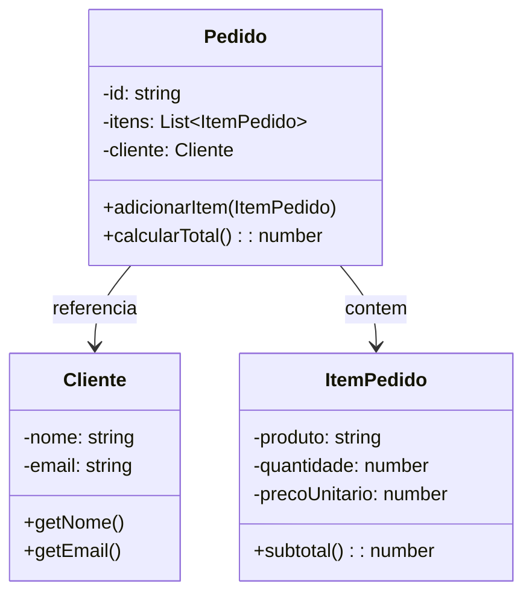

# Programação orientada a objetos

## Definição e pilares

Na **programação orientada a objetos (OO)**, o programa é organizado em **objetos** que combinam **dados** (atributos) e **comportamento** (métodos). Cada objeto é uma instância de uma **classe**, que define a estrutura e as operações. O paradigma enfatiza **encapsulamento**, **herança** e **polimorfismo**, e costuma ser apresentado com um quarto pilar, **abstração**.

- **Encapsulamento:** esconder detalhes internos e expor apenas uma interface; o estado é acessado ou alterado por métodos.
- **Herança:** uma classe pode estender outra, reutilizando e especializando comportamento.
- **Polimorfismo:** referências a tipos base podem apontar para subtipos; a chamada de método é resolvida em tempo de execução (subtipagem).
- **Abstração:** classes e interfaces representam conceitos do domínio, reduzindo a complexidade percebida.

Linguagens representativas: **Java**, **C#**, **TypeScript** (com classes), **Python**, **Ruby**, **Kotlin**.

---

## Quando usar

OO é especialmente útil quando:

- O **domínio** tem entidades claras (usuário, pedido, pagamento) e relações entre elas (agregação, herança).
- Você precisa de **reuso** por especialização (subclasses) e de **substituição** via polimorfismo (testes com mocks, plugins).
- O sistema é **grande** e a equipe se apoia em convenções (SOLID, camadas, injeção de dependência).
- O ecossistema (frameworks, bibliotecas) é orientado a objetos (Spring, .NET, NestJS).

OO pode ficar pesado em domínios muito orientados a dados ou a transformações (pipelines); aí funcional ou híbrido costuma complementar.

---

## Diagrama de classes (exemplo)

Modelo simples: um `Pedido` contém vários `ItemPedido` e está associado a um `Cliente`. O `Pedido` calcula o total delegando aos itens.



---

## Exemplo em Java

```java
import java.util.ArrayList;
import java.util.List;

public class Cliente {
    private final String nome;
    private final String email;

    public Cliente(String nome, String email) {
        this.nome = nome;
        this.email = email;
    }
    public String getNome() { return nome; }
    public String getEmail() { return email; }
}

public class ItemPedido {
    private final String produto;
    private final int quantidade;
    private final double precoUnitario;

    public ItemPedido(String produto, int quantidade, double precoUnitario) {
        this.produto = produto;
        this.quantidade = quantidade;
        this.precoUnitario = precoUnitario;
    }
    public double subtotal() { return quantidade * precoUnitario; }
}

public class Pedido {
    private final String id;
    private final Cliente cliente;
    private final List<ItemPedido> itens = new ArrayList<>();

    public Pedido(String id, Cliente cliente) {
        this.id = id;
        this.cliente = cliente;
    }
    public void adicionarItem(ItemPedido item) { itens.add(item); }
    public double calcularTotal() {
        return itens.stream().mapToDouble(ItemPedido::subtotal).sum();
    }
}

// Uso
Cliente c = new Cliente("Maria", "maria@example.com");
Pedido p = new Pedido("P001", c);
p.adicionarItem(new ItemPedido("Livro", 2, 29.90));
p.adicionarItem(new ItemPedido("Caneta", 5, 2.50));
System.out.println("Total: " + p.calcularTotal());
```

O estado fica encapsulado nas classes; o comportamento (cálculo, adição de itens) é exposto por métodos. O cliente do `Pedido` não acessa a lista interna diretamente.

---

## Exemplo em TypeScript

A mesma ideia com classes e tipagem:

```typescript
class Cliente {
  constructor(
    private readonly nome: string,
    private readonly email: string
  ) {}
  getNome(): string { return this.nome; }
  getEmail(): string { return this.email; }
}

class ItemPedido {
  constructor(
    private readonly produto: string,
    private readonly quantidade: number,
    private readonly precoUnitario: number
  ) {}
  subtotal(): number { return this.quantidade * this.precoUnitario; }
}

class Pedido {
  private readonly itens: ItemPedido[] = [];
  constructor(
    private readonly id: string,
    private readonly cliente: Cliente
  ) {}
  adicionarItem(item: ItemPedido): void { this.itens.push(item); }
  calcularTotal(): number {
    return this.itens.reduce((s, i) => s + i.subtotal(), 0);
  }
}

const cliente = new Cliente("Maria", "maria@example.com");
const pedido = new Pedido("P001", cliente);
pedido.adicionarItem(new ItemPedido("Livro", 2, 29.90));
pedido.adicionarItem(new ItemPedido("Caneta", 5, 2.50));
console.log("Total:", pedido.calcularTotal());
```

Herança e polimorfismo entram quando definimos hierarquias (por exemplo, `Pagamento` abstrato com `PagamentoCartao` e `PagamentoPix`) ou interfaces para desacoplar (repositórios, serviços).

---

## Exemplo em C#

```csharp
using System;
using System.Collections.Generic;
using System.Linq;

public class Cliente
{
    public string Nome { get; }
    public string Email { get; }
    public Cliente(string nome, string email) { Nome = nome; Email = email; }
}

public class ItemPedido
{
    public string Produto { get; }
    public int Quantidade { get; }
    public double PrecoUnitario { get; }
    public ItemPedido(string produto, int qty, double preco) {
        Produto = produto; Quantidade = qty; PrecoUnitario = preco;
    }
    public double Subtotal => Quantidade * PrecoUnitario;
}

public class Pedido
{
    public string Id { get; }
    public Cliente Cliente { get; }
    private readonly List<ItemPedido> _itens = new();
    public Pedido(string id, Cliente cliente) { Id = id; Cliente = cliente; }
    public void AdicionarItem(ItemPedido item) => _itens.Add(item);
    public double CalcularTotal() => _itens.Sum(i => i.Subtotal);
}

// Uso
var c = new Cliente("Maria", "maria@example.com");
var p = new Pedido("P001", c);
p.AdicionarItem(new ItemPedido("Livro", 2, 29.90));
p.AdicionarItem(new ItemPedido("Caneta", 5, 2.50));
Console.WriteLine("Total: " + p.CalcularTotal());
```

Properties e métodos encapsulam o estado; a lista interna não é exposta.

---

## Exemplo em Python

```python
class Cliente:
    def __init__(self, nome, email):
        self._nome = nome
        self._email = email
    @property
    def nome(self): return self._nome
    @property
    def email(self): return self._email

class ItemPedido:
    def __init__(self, produto, quantidade, preco_unitario):
        self._produto = produto
        self._quantidade = quantidade
        self._preco_unitario = preco_unitario
    def subtotal(self): return self._quantidade * self._preco_unitario

class Pedido:
    def __init__(self, id_pedido, cliente):
        self._id = id_pedido
        self._cliente = cliente
        self._itens = []
    def adicionar_item(self, item): self._itens.append(item)
    def calcular_total(self): return sum(i.subtotal() for i in self._itens)

c = Cliente("Maria", "maria@example.com")
p = Pedido("P001", c)
p.adicionar_item(ItemPedido("Livro", 2, 29.90))
p.adicionar_item(ItemPedido("Caneta", 5, 2.50))
print("Total:", p.calcular_total())
```

Convenção com `_` indica atributos “privados”; propriedades e métodos definem a interface.

---

## Exemplo em Clojure (protocolos e records)

Clojure não tem classes no sentido OO; **records** e **protocols** permitem polimorfismo e encapsulamento de dados:

```clojure
(defprotocol Subtotal
  (subtotal [this]))

(defrecord ItemPedido [produto quantidade preco-unitario]
  Subtotal
  (subtotal [this] (* (:quantidade this) (:preco-unitario this))))

(defrecord Pedido [id cliente itens]
  Subtotal
  (subtotal [this] (reduce + (map subtotal (:itens this)))))

(defn adicionar-item [pedido item]
  (update pedido :itens conj item))

(def cliente {:nome "Maria" :email "maria@example.com"})
(def p (-> (->Pedido "P001" cliente [])
           (adicionar-item (->ItemPedido "Livro" 2 29.90))
           (adicionar-item (->ItemPedido "Caneta" 5 2.50))))
(println "Total:" (subtotal p))
```

Dados são imutáveis; “alterações” produzem novos records. O protocolo `Subtotal` permite polimorfismo sem herança de classes.

---

## Herança e composição

A herança (“é um”) deve ser usada com critério: subtipos reais (um `PagamentoPix` é um `Pagamento`). Para reuso de comportamento sem hierarquia rígida, **composição** (“tem um”) costuma ser mais flexível: o `Pedido` tem um `Cliente` e uma lista de `ItemPedido`, em vez de herdar de algo. Princípios como “prefira composição à herança” (GoF) e SOLID ajudam a manter o modelo estável.

---

## Vantagens e desvantagens

| Vantagens | Desvantagens |
|-----------|----------------|
| Modelagem próxima ao domínio (entidades, relações) | Hierarquias profundas ou mal desenhadas viram “inferno de manutenção” |
| Encapsulamento reduz acoplamento direto aos dados | Estado mutável em objetos dificulta testes e concorrência |
| Polimorfismo permite extensão sem alterar código existente | Overhead de abstração em problemas muito simples |
| Ecossistema rico (frameworks, ferramentas, padrões) | Mistura de responsabilidades se a disciplina (SRP, etc.) for fraca |

---

## Resumo

OO organiza o sistema em **objetos** (instâncias de classes) que encapsulam dados e comportamento. Encapsulamento, herança e polimorfismo permitem modelar domínios complexos e evoluir o código com menos impacto. Em projetos grandes, OO costuma ser combinado com padrões (repositório, serviço, injeção de dependência) e, quando o problema for mais “fluxo de dados”, com elementos funcionais ou reativos.

---

*Próximo: [Programação orientada a eventos](./04-programacao-orientada-a-eventos.md).*
