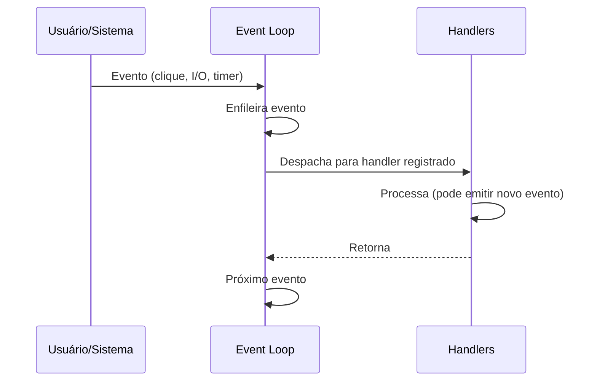

# Programação orientada a eventos

## Definição e características

Na **programação orientada a eventos**, o fluxo do programa é dirigido por **eventos**: ações do usuário, mensagens de rede, sinais de hardware, timers. Em vez de um script linear que “pergunta e espera”, o código registra **handlers** (callbacks) que são invocados quando um evento ocorre. O núcleo da aplicação é um **loop de eventos** que despacha ocorrências para os handlers registrados.

Características principais:

- **Desacoplamento** entre quem emite o evento e quem reage; produtores e consumidores não se conhecem diretamente.
- **Assincronia:** o programa não bloqueia esperando uma operação; ele registra o que fazer quando a operação terminar.
- **Reatividade:** a lógica é acionada por ocorrências externas (clique, resposta HTTP, mensagem em fila).

Contextos típicos: **interfaces gráficas** (botões, teclado, rede), **servidores de I/O** (Node.js, Nginx), **sistemas embarcados** (interrupções), **mensageria** (filas, pub/sub).

---

## Quando usar

O paradigma orientado a eventos é adequado quando:

- Há muitas **fontes de entrada** assíncronas (usuário, rede, sensores) e não faz sentido um fluxo único e bloqueante.
- Você quer **escalar** por I/O (servidor que atende muitos clientes com poucas threads, usando callbacks ou async/await).
- O domínio é **reativo** por natureza (UI, dashboards, integração com sistemas externos).
- O sistema precisa **responder** a ocorrências em tempo real (notificações, alertas, comandos).

Ele pode complicar o fluxo se houver muitas cadeias de callbacks (“callback hell”); aí entram Promises, async/await ou padrões reativos (streams) para linearizar.

---

## Modelo: loop de eventos e handlers



O programa não “chama” o handler em um ponto fixo; o **runtime** (navegador, Node.js, framework UI) invoca o handler quando o evento ocorre. O desenvolvedor **registra** associações evento → handler.

---

## Exemplo: navegador (DOM)

No front-end, cliques e formulários são eventos do DOM; registramos listeners:

```javascript
// Registrar handler para clique
document.getElementById("btnSalvar").addEventListener("click", function (event) {
  event.preventDefault();
  const nome = document.getElementById("nome").value;
  if (!nome.trim()) {
    alert("Nome é obrigatório");
    return;
  }
  salvarUsuario(nome);
});

// Handler para envio de formulário
document.querySelector("form").addEventListener("submit", function (event) {
  event.preventDefault();
  const data = new FormData(event.target);
  fetch("/api/usuarios", { method: "POST", body: data })
    .then((res) => res.json())
    .then((d) => console.log("Criado:", d))
    .catch((err) => console.error(err));
});
```

O fluxo não é “leia um clique, depois outro”; é “quando houver clique nesse botão, execute esta função”. O **quando** é definido pelo ambiente de execução.

---

## Exemplo: Node.js (I/O assíncrono)

Em Node.js, operações de arquivo e rede são assíncronas e notificam conclusão via callback (ou Promise):

```javascript
const fs = require("fs");
const http = require("http");

// Evento: arquivo lido
fs.readFile("config.json", "utf8", (err, data) => {
  if (err) {
    console.error("Erro ao ler config:", err);
    return;
  }
  const config = JSON.parse(data);
  iniciarServidor(config.porta);
});

function iniciarServidor(porta) {
  const server = http.createServer((req, res) => {
    // Evento: requisição HTTP recebida
    if (req.url === "/health") {
      res.writeHead(200, { "Content-Type": "application/json" });
      res.end(JSON.stringify({ status: "ok" }));
      return;
    }
    res.writeHead(404);
    res.end();
  });
  server.listen(porta, () => {
    console.log("Servidor em http://localhost:" + porta);
  });
}
```

O `createServer` registra um handler que será chamado a cada nova requisição; quem “dispara” é o runtime, não o seu código em sequência.

---

## Exemplo: EventEmitter (padrão pub/sub)

Muitas plataformas oferecem um objeto que emite e escuta eventos nomeados (padrão pub/sub):

```javascript
const EventEmitter = require("events");

const bus = new EventEmitter();

// Consumidor: reagir ao evento "pedido:criado"
bus.on("pedido:criado", (pedido) => {
  console.log("Novo pedido:", pedido.id);
  enviarEmailConfirmacao(pedido.clienteEmail);
});

bus.on("pedido:criado", (pedido) => {
  atualizarEstoque(pedido.itens);
});

// Produtor: emitir evento (desacoplado de quem consome)
function criarPedido(dados) {
  const pedido = { id: gerarId(), ...dados };
  bus.emit("pedido:criado", pedido);
  return pedido;
}
```

Vários handlers podem reagir ao mesmo evento; quem chama `emit` não precisa conhecer os listeners. Isso facilita extensão (novos módulos só registram seus handlers) e testes (emitir eventos simulados).

---

## Callbacks, Promises e async/await

O estilo “puro” de eventos usa callbacks. Em JavaScript, **Promises** e **async/await** organizam a sequência de operações assíncronas sem aninhar callbacks:

```javascript
async function carregarPedido(id) {
  const res = await fetch(`/api/pedidos/${id}`);
  if (!res.ok) throw new Error("Pedido não encontrado");
  const pedido = await res.json();
  const cliente = await buscarCliente(pedido.clienteId);
  return { ...pedido, cliente };
}
```

Por baixo, a execução continua orientada a eventos (I/O não bloqueia); a sintaxe é que fica linear e legível.

---

## Exemplo em C# (eventos e async/await)

Em C#, eventos (event + delegate) e async/await são o padrão para I/O e reação a ações:

```csharp
using System;
using System.Net.Http;
using System.Threading.Tasks;

// Evento customizado: delegate + event
public class PedidoService
{
    public event Action<object> PedidoCriado;
    public void CriarPedido(object pedido)
    {
        // ... lógica ...
        PedidoCriado?.Invoke(pedido);
    }
}

// Async/await: reação à conclusão da operação (evento “tarefa concluída”)
public async Task CarregarPedidoAsync(int id)
{
    using var client = new HttpClient();
    var json = await client.GetStringAsync($"https://api.example.com/pedidos/{id}");
    var pedido = System.Text.Json.JsonSerializer.Deserialize<object>(json);
    return pedido;
}
```

O runtime dispara a continuação quando a tarefa assíncrona termina; o código reage ao “evento” de conclusão sem bloquear a thread.

---

## Exemplo em Python (asyncio)

Python usa **asyncio** para I/O assíncrono: coroutines e um loop de eventos.

```python
import asyncio

async def buscar_pedido(id):
    # Simula I/O (em produção: aiohttp, etc.)
    await asyncio.sleep(0.1)
    return {"id": id, "total": 100.0}

async def main():
    pedido = await buscar_pedido(1)
    print("Pedido:", pedido)

asyncio.run(main())
```

O loop de eventos do asyncio despacha as coroutines; `await` registra “quando terminar, continue aqui”.

---

## Exemplo em Clojure (core.async e callbacks)

Em Clojure, **core.async** oferece canais (similar a filas de eventos) e **go blocks** que reagem a valores:

```clojure
(require '[clojure.core.async :as a])

(defn criar-pedido! [chan dados]
  (a/go (a/>! chan {:evento :pedido-criado :dados dados})))

(def canal (a/chan 10))
;; Consumidor: reage aos eventos no canal
(a/go-loop []
  (when-let [msg (a/<! canal)]
    (println "Evento:" msg)
    (recur)))
;; Produtor
(criar-pedido! canal {:id 1 :cliente "A"})
```

Quem envia não conhece quem consome; o canal desacopla produtor e consumidor, no mesmo espírito de um event bus.

---

## Vantagens e desvantagens

| Vantagens | Desvantagens |
|-----------|----------------|
| Desacoplamento entre produtor e consumidor de eventos | Fluxo de execução menos óbvio que um script linear |
| Escalabilidade para I/O (muitas conexões, poucas threads) | Debug e rastreamento mais difíceis (stack assíncrona) |
| Modelo natural para UIs e sistemas reativos | Callback hell se não houver Promises/async ou abstrações |
| Extensibilidade (novos handlers sem alterar o emissor) | Risco de vazamento de memória se listeners não forem removidos |

---

## Resumo

Na programação orientada a eventos, o **fluxo é dirigido por eventos**; o programa registra **handlers** e um **loop de eventos** os invoca quando algo ocorre. É o modelo base de UIs, servidores assíncronos e sistemas reativos. Callbacks, Promises e async/await são formas de expressar reações a eventos; em cenários com muitos fluxos contínuos, o paradigma **reativo** (streams) costuma ser o próximo passo.

---

*Próximo: [Programação funcional (React e Clojure)](./05-programacao-funcional.md).*
