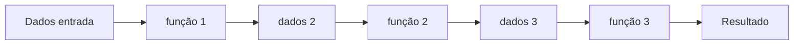

# Programação funcional (React e Clojure)

## Definição e princípios

Na **programação funcional**, o programa é construído a partir de **funções** que recebem valores e produzem valores, com ênfase em **imutabilidade**, **funções puras** e **composição**. Evita-se efeito colateral explícito (mutação de estado global, I/O descontrolado); quando necessário, efeitos são isolados e previsíveis (por exemplo em bordas do sistema ou em monads).

Principais ideias:

- **Funções puras:** mesmo argumento → mesmo resultado; sem ler ou alterar estado externo.
- **Imutabilidade:** dados não são alterados no lugar; “mudanças” são novas estruturas derivadas das antigas.
- **Funções como valores:** funções podem ser passadas como argumento, retornadas e compostas (higher-order functions).
- **Expressividade:** programas descritos como transformações (map, filter, reduce) em vez de loops e mutações.

Linguagens funcionais “puras” ou com forte influência: **Haskell**, **Clojure**, **Elm**, **Elixir**. **JavaScript/TypeScript** e **React** permitem (e incentivam) estilo funcional em componentes e no tratamento de estado.

---

## Quando usar

O paradigma funcional é especialmente útil quando:

- O **domínio** é rico em transformações de dados (pipelines, relatórios, ETL).
- Você prioriza **testabilidade** e **previsibilidade** (funções puras são fáceis de testar).
- Há **concorrência** ou paralelismo (dados imutáveis reduzem race conditions).
- O front-end usa **React**: componentes funcionais e hooks seguem ideias funcionais (redução de efeitos, composição).

Ele pode ser menos natural quando o problema é muito “estado e mutação” (simulações, jogos) ou quando a equipe e o ecossistema são fortemente OO; mesmo assim, funções puras e imutabilidade costumam ser adotadas em partes do sistema.

---

## Diagrama: fluxo de dados imutável

Em um pipeline funcional, cada etapa recebe dados e produz **novos** dados; o original não é alterado.



Não há “objeto mutável” no meio; há **valores** que fluem de uma função para a outra. Em Clojure e em React (com estado imutável), esse modelo é central.

---

## Exemplo em Clojure

Clojure é funcional por padrão: estruturas de dados imutáveis, funções de primeira classe, sem classes.

```clojure
;; Dados imutáveis: mapas e vetores
(def pedidos
  [{:id 1 :cliente "A" :valor 100}
   {:id 2 :cliente "B" :valor 250}
   {:id 3 :cliente "A" :valor 80}])

;; Funções puras: não alteram pedidos, retornam novo valor
(defn total-do-pedido [p]
  (:valor p))

(defn total-geral [pedidos]
  (reduce + (map total-do-pedido pedidos)))

(defn pedidos-do-cliente [cliente pedidos]
  (filter #(= (:cliente %) cliente) pedidos))

;; Composição
(println "Total geral:" (total-geral pedidos))
;; => Total geral: 430

(println "Pedidos de A:" (pedidos-do-cliente "A" pedidos))
;; => ({:id 1 :cliente "A" :valor 100} {:id 3 :cliente "A" :valor 80})

;; "Alterar" é criar novo dado (assoc, update, conj)
(def pedido-atualizado (update (first pedidos) :valor * 1.1))
;; pedidos continua igual; pedido-atualizado é um novo mapa
```

Não há variáveis mutáveis no sentido tradicional; há **binding** de nomes a valores. Reuso e extensão vêm de funções que recebem outras funções (map, filter, reduce, comp).

---

## Exemplo em React (componentes funcionais e hooks)

React não é uma linguagem funcional, mas desde hooks a recomendação é **componentes funcionais** e estado tratado de forma previsível (imutabilidade ao atualizar estado).

```tsx
import { useState, useCallback } from "react";

// Componente funcional: props in, UI out (como função pura da props)
function ListaPedidos({ pedidos, onSelecionar }: Props) {
  return (
    <ul>
      {pedidos.map((p) => (
        <li key={p.id} onClick={() => onSelecionar(p)}>
          {p.cliente} – R$ {p.valor.toFixed(2)}
        </li>
      ))}
    </ul>
  );
}

// Estado com atualização imutável (novo array/objeto, não mutação)
function App() {
  const [pedidos, setPedidos] = useState([
    { id: 1, cliente: "A", valor: 100 },
    { id: 2, cliente: "B", valor: 250 },
  ]);

  const adicionarPedido = useCallback((novo) => {
    setPedidos((prev) => [...prev, novo]); // novo array, não push
  }, []);

  const total = pedidos.reduce((s, p) => s + p.valor, 0); // derivado, não estado

  return (
    <div>
      <p>Total: R$ {total.toFixed(2)}</p>
      <ListaPedidos pedidos={pedidos} onSelecionar={() => {}} />
    </div>
  );
}
```

O componente é uma **função** de (props, contexto) → elemento; atualizações de estado usam **novos** valores (spread, concat) em vez de mutar. Efeitos (I/O, assinaturas) ficam em `useEffect`, concentrados e explícitos.

---

## Funções de ordem superior (map, filter, reduce)

Tanto em Clojure quanto em JavaScript, o dia a dia funcional usa funções que recebem ou retornam funções:

```javascript
// JavaScript: pipeline de transformações
const pedidos = [
  { id: 1, cliente: "A", valor: 100 },
  { id: 2, cliente: "B", valor: 250 },
  { id: 3, cliente: "A", valor: 80 },
];
const totalA = pedidos
  .filter((p) => p.cliente === "A")
  .map((p) => p.valor)
  .reduce((a, b) => a + b, 0);
console.log(totalA); // 180
```

Em Clojure o mesmo padrão com `filter`, `map`, `reduce` (ou `map` + `reduce`) e threading (`->`, `->>`). O código declara **o quê** fazer (filtrar, mapear, somar), não **como** iterar com índices e variáveis mutáveis.

---

## Exemplo em C# (LINQ e imutabilidade)

C# com **LINQ** e tipos imutáveis (readonly, record) permite pipelines funcionais:

```csharp
using System;
using System.Collections.Immutable;
using System.Linq;

var pedidos = ImmutableArray.Create(
    new { Id = 1, Cliente = "A", Valor = 100.0 },
    new { Id = 2, Cliente = "B", Valor = 250.0 },
    new { Id = 3, Cliente = "A", Valor = 80.0 }
);
// Pipeline declarativo: filtrar, mapear, somar (sem mutar pedidos)
double totalA = pedidos
    .Where(p => p.Cliente == "A")
    .Select(p => p.Valor)
    .Sum();
Console.WriteLine(totalA); // 180
```

Records (C# 9+) são imutáveis por padrão; LINQ trabalha sobre sequências sem alterá-las.

---

## Exemplo em Python (funções e imutabilidade)

Python com funções de primeira classe e estruturas imutáveis (tuplas, frozenset) ou disciplina de não-mutar:

```python
pedidos = [
    {"id": 1, "cliente": "A", "valor": 100},
    {"id": 2, "cliente": "B", "valor": 250},
    {"id": 3, "cliente": "A", "valor": 80},
]
# Pipeline: filter → map → reduce (sem alterar pedidos)
total_a = sum(p["valor"] for p in pedidos if p["cliente"] == "A")
# ou com funções
from functools import reduce
total_a = reduce(
    lambda a, b: a + b,
    map(lambda p: p["valor"], filter(lambda p: p["cliente"] == "A", pedidos)),
    0,
)
```

Generators e list comprehensions expressam “o quê” (transformação) em vez de loops mutando acumuladores.

---

## Vantagens e desvantagens

| Vantagens | Desvantagens |
|-----------|----------------|
| Testes simples (entrada/saída, sem mock de estado global) | Curva de aprendizado em linguagens puras (Haskell, Clojure) |
| Menos bugs de concorrência (dados imutáveis) | Performance em cenários de muita cópia (mitigado por estruturas persistentes em Clojure) |
| Código composável e reutilizável (funções pequenas e puras) | I/O e efeitos precisam de disciplina (bordas, monads, hooks) |
| Alinhado com React e com pipelines de dados | Mistura com OO/imperativo em projetos híbridos exige convenções claras |

---

## Resumo

A programação funcional enfatiza **funções puras**, **dados imutáveis** e **composição**. Em **Clojure**, isso aparece em todo o código (estruturas imutáveis, sem classes). Em **React**, componentes funcionais e atualizações imutáveis de estado seguem o mesmo espírito. O paradigma reduz efeitos colaterais e facilita testes e evolução; em sistemas reais costuma conviver com OO e com programação orientada a eventos.

---

*Próximo: [Programação declarativa](./06-programacao-declarativa.md).*
