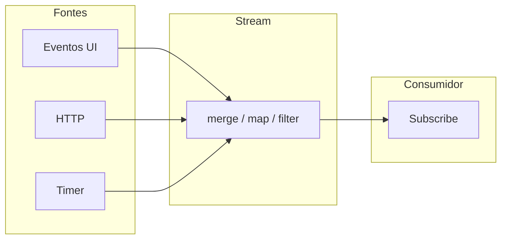

# Programação reativa

## Definição e conceitos

A **programação reativa** modela o software em termos de **fluxos de dados no tempo** e de **reação** a eles. Em vez de chamadas diretas ou callbacks isolados, os dados são tratados como **streams** (sequências assíncronas de eventos ou valores) que podem ser transformados, filtrados, combinados e assinados. Mudanças em uma fonte propagam-se de forma declarativa até os consumidores (observers).

Conceitos centrais:

- **Observable / Stream:** representação de uma sequência de valores ou eventos ao longo do tempo, que pode ser infinita (cliques, teclas, posição do mouse).
- **Operadores:** transformações sobre streams (map, filter, merge, debounce, throttle) de forma composável.
- **Assinatura (subscribe):** o consumidor se inscreve no stream e reage a cada valor ou erro; há um ciclo de vida (cancelar assinatura).
- **Backpressure:** quando o produtor é mais rápido que o consumidor, o protocolo reativo pode controlar o ritmo (evitar estouro de memória ou filas infinitas).

Padrões e bibliotecas: **Reactive Extensions (Rx)** (RxJS, RxJava, etc.), **Reactive Streams** (Java), **Reactor** (Spring), **Kotlin Flow**, e no front-end **RxJS** e conceitos similares em bibliotecas de estado (MobX, sinais).

---

## Quando usar

O paradigma reativo é adequado quando:

- Há **muitas fontes** de eventos ou dados assíncronos (UI, rede, sensores, filas) que precisam ser **combinados** ou **transformados** em fluxo contínuo.
- Você quer **backpressure** e **cancelamento** explícito (evitar vazamento de memória e sobrecarga).
- O domínio é **orientado a tempo** (dashboards, telemetria, áudio/vídeo, cotações).
- A arquitetura já usa **mensageria** ou **event-driven** e você quer padronizar com operadores e composição.

Pode ser excessivo para fluxos simples (uma requisição HTTP, um clique); aí Promises ou async/await costumam bastar.

---

## Diagrama: produtor, stream e consumidor



Várias fontes alimentam um pipeline de operadores; o resultado é um único stream que o consumidor assina. O consumidor não conhece as fontes originais; só reage aos valores que saem do pipeline.

---

## Exemplo com RxJS (JavaScript)

RxJS é a implementação de Reactive Extensions para JavaScript. Observables representam sequências assíncronas; operadores compõem transformações.

```javascript
import { fromEvent, map, filter, debounceTime, merge } from "rxjs";

// Stream de cliques no botão
const cliques = fromEvent(document.getElementById("btn"), "click");

// Stream de teclas no input, com debounce
const input = document.getElementById("busca");
const digitacao = fromEvent(input, "input").pipe(
  map((e) => e.target.value),
  debounceTime(300),
  filter((texto) => texto.length >= 2)
);

// Combinar: reagir a clique OU a busca com 2+ caracteres
merge(
  cliques.pipe(map(() => "clique")),
  digitacao.pipe(map((v) => `busca:${v}`))
).subscribe((resultado) => {
  console.log("Ação:", resultado);
  atualizarLista(resultado);
});
```

Não há variáveis globais para “último valor” nem callbacks aninhados; há **streams** e **assinatura**. Cancelar a assinatura (unsubscribe) encerra a reação e libera recursos.

---

## Exemplo: React com fluxo reativo (conceito)

Em React, o padrão “fluxo de dados” é unidirecional: estado → UI; eventos → atualização de estado. Bibliotecas como RxJS podem ser usadas para **fontes** de dados (WebSocket, polling) e depois o resultado é colocado em estado para a UI re-renderizar. O “reativo” aqui é a camada de dados; a UI continua declarativa (React).

```javascript
// Exemplo conceitual: stream de mensagens WebSocket
import { useEffect, useState } from "react";
import { fromEvent, map } from "rxjs";

function useMensagens(socket) {
  const [mensagens, setMensagens] = useState([]);
  useEffect(() => {
    const sub = fromEvent(socket, "message")
      .pipe(map((e) => JSON.parse(e.data)))
      .subscribe((msg) => setMensagens((prev) => [...prev, msg]));
    return () => sub.unsubscribe();
  }, [socket]);
  return mensagens;
}
```

O Observable encapsula o evento do socket; o subscribe atualiza o estado do React de forma imutável; o cleanup faz unsubscribe. Assim, programação reativa e React coexistem: reativo na fonte, declarativo na UI.

---

## Exemplo em C# (System.Reactive / Rx.NET)

No .NET, **System.Reactive (Rx)** oferece `IObservable<T>` e operadores análogos ao RxJS:

```csharp
using System;
using System.Reactive.Linq;
using System.Windows.Forms;

// Stream de cliques (exemplo WinForms; em WPF/MAUI há integração similar)
var form = new Form();
var cliques = Observable.FromEventPattern<EventArgs>(form, "Click")
    .Select(_ => DateTime.Now);
var debounced = cliques.Throttle(TimeSpan.FromSeconds(1));
debounced.Subscribe(ts => Console.WriteLine("Clique (throttled): " + ts));
```

Backpressure e cancelamento via `IDisposable` retornado por `Subscribe`. Em aplicações .NET modernas, Rx ou **IAsyncEnumerable** cobrem cenários reativos e assíncronos.

---

## Exemplo em Node.js (streams nativos)

Os **streams** do Node.js (Readable, Writable, Transform) são um modelo reativo nativo: dados fluem em chunks e podem ser encadeados com `.pipe()`:

```javascript
const fs = require("fs");
const { Transform } = require("stream");

const leitor = fs.createReadStream("entrada.json");
const transformador = new Transform({
  objectMode: true,
  transform(chunk, enc, cb) {
    const obj = JSON.parse(chunk.toString());
    this.push(JSON.stringify({ ...obj, processado: true }));
    cb();
  },
});
const escritor = fs.createWriteStream("saida.json");
leitor.pipe(transformador).pipe(escritor);
```

Cada estágio reage aos dados que chegam; backpressure é propagado automaticamente pelo pipeline.

---

## Backpressure e cancelamento

Em streams com produtor rápido (sensor, fila), o consumidor pode não acompanhar. Reactive Streams (e Rx com estratégias) permitem que o consumidor sinalize “quantos itens pode receber” (backpressure). Em RxJS, operadores como `buffer`, `throttle` ou `sample` reduzem a taxa. **Cancelar** a assinatura (unsubscribe) é essencial para evitar vazamento de memória e lógica ativa após o componente ser desmontado.

---

## Vantagens e desvantagens

| Vantagens | Desvantagens |
|-----------|----------------|
| Composição poderosa de fontes assíncronas (merge, zip, switchMap) | Curva de aprendizado (muitos operadores e comportamentos) |
| Tratamento uniforme de tempo (debounce, throttle, delay) | Debug de fluxos complexos pode ser difícil |
| Backpressure e cancelamento explícitos | Pode ser overkill para fluxos simples |
| Alinhado com arquiteturas event-driven e mensageria | Mistura com Promises/async exige integração (from, firstValueFrom) |

---

## Resumo

A programação **reativa** trata dados e eventos como **streams** no tempo, com **operadores** (map, filter, merge, debounce) e **assinatura** (subscribe). É útil quando há muitas fontes assíncronas, necessidade de backpressure e cenários orientados a tempo (UI, telemetria, integração). RxJS, Reactive Streams e Reactor são implementações comuns; em front-end e backend, o paradigma reativo complementa o funcional e o orientado a eventos.

---

*Fim do estudo. Voltar ao [índice](./README.md).*
