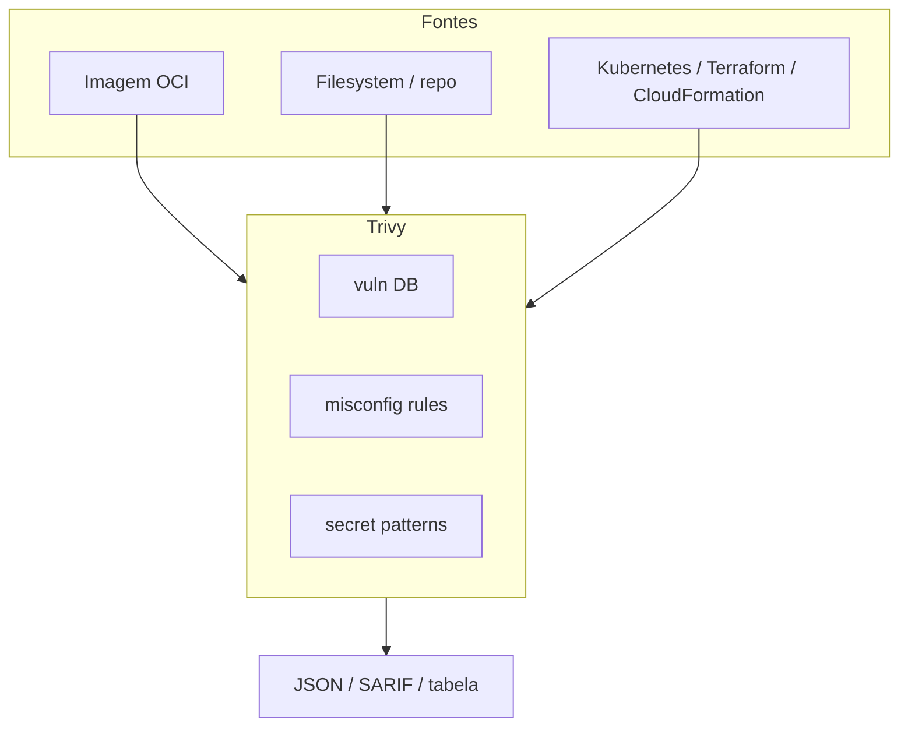
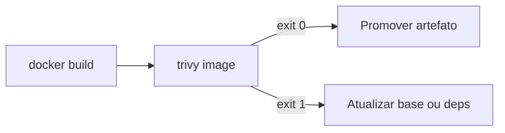
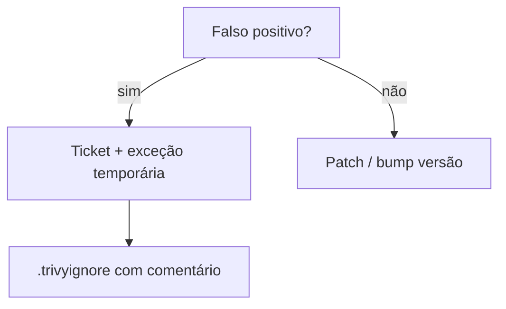

# Trivy — instalação, scan no projeto e integração em CI

## Introdução

**Trivy** (Aqua Security) é um scanner **open source** amplamente adotado para **imagens de contêiner**, **filesystem**, **repositório Git**, **Kubernetes**, **Terraform** e **secrets**. Ele agrega **CVE** em pacotes do SO e bibliotecas, **misconfigurations** em IaC e **detecção heurística de segredos** — ideal para **shift-left** no laptop e como **gate** no pipeline.



---

## Instalação

### Linux / WSL (deb via repositório Aqua — exemplo)

Consulte a [documentação oficial](https://trivy.dev/) para URLs atualizadas. Padrão comum:

```bash
sudo apt-get install wget gnupg
wget -qO - https://aquasecurity.github.io/trivy-repo/deb/public.key | sudo apt-key add -
echo "deb https://aquasecurity.github.io/trivy-repo/deb $(lsb_release -sc) main" | sudo tee /etc/apt/sources.list.d/trivy.list
sudo apt-get update && sudo apt-get install trivy
trivy --version
```

### macOS (Homebrew)

```bash
brew install trivy
```

### Windows (Scoop / Chocolatey)

```powershell
scoop install trivy
# ou: choco install trivy
```

### Contêiner (sem instalar no host)

```bash
docker run --rm -v /var/run/docker.sock:/var/run/docker.sock \
  aquasec/trivy:latest image --severity HIGH,CRITICAL myapp:local
```

---

## Projeto de laboratório

Considere um repositório com:

- `Dockerfile` multi-stage construindo uma API.
- `package-lock.json` ou `requirements.txt` / `pom.xml`.
- Pasta `k8s/` com um `deployment.yaml` simples.

```text
seguranca-lab/
├── Dockerfile
├── src/
├── k8s/
│   └── deployment.yaml
└── .github/workflows/trivy.yml
```

---

## Escanear imagem local

```bash
docker build -t seguranca-lab:local .
trivy image --severity HIGH,CRITICAL --exit-code 1 seguranca-lab:local
```

- `--exit-code 1` faz o comando falhar se houver achados — padrão para **CI**.
- `--ignore-unfixed` reduz ruído quando não há patch disponível (use com critério).



---

## Escanear filesystem e IaC

```bash
# Vulnerabilidades em dependências + configs
trivy fs --scanners vuln,misconfig --severity HIGH,CRITICAL .

# Incluir secrets (cuidado: pode acusar exemplos em docs)
trivy fs --scanners vuln,misconfig,secret --severity HIGH,CRITICAL .
```

Para **só Kubernetes**:

```bash
trivy config k8s/
```

---

## Ignorar com governança

- **`.trivyignore`** — IDs de CVE ou regras; cada linha deve ter **justificativa** no PR.
- Flags como `--skip-files` para *fixtures* conhecidas.



---

## Integração em CI

### GitHub Actions (mínimo)

```yaml
name: trivy
on: [push, pull_request]
jobs:
  scan:
    runs-on: ubuntu-latest
    steps:
      - uses: actions/checkout@v4
      - uses: aquasecurity/trivy-action@master
        with:
          scan-type: fs
          severity: CRITICAL,HIGH
          exit-code: 1
```

### Makefile (time uniformiza flags)

```makefile
.PHONY: trivy-fs trivy-image
IMAGE ?= seguranca-lab:local

trivy-fs:
	trivy fs . --severity HIGH,CRITICAL --exit-code 1

trivy-image:
	docker build -t $(IMAGE) .
	trivy image --severity HIGH,CRITICAL --exit-code 1 $(IMAGE)
```

---

## Scripts em mais de uma linguagem

### Python — wrapper com SARIF opcional

```python
import os
import subprocess
import sys

def run_trivy_fs(path: str = ".") -> int:
    cmd = [
        "trivy", "fs", path,
        "--severity", "HIGH,CRITICAL",
        "--exit-code", "1",
    ]
    if os.environ.get("TRIVY_SARIF"):
        cmd += ["--format", "sarif", "--output", "trivy-fs.sarif"]
    return subprocess.call(cmd)

if __name__ == "__main__":
    sys.exit(run_trivy_fs())
```

### Node.js — `child_process` + relatório JSON

```javascript
import { spawnSync } from "node:child_process";

function scanFs(cwd = process.cwd()) {
  const r = spawnSync(
    "trivy",
    ["fs", cwd, "--severity", "HIGH,CRITICAL", "--format", "json", "--output", "report.json", "--exit-code", "1"],
    { stdio: "inherit", shell: false },
  );
  process.exit(r.status ?? 1);
}

scanFs();
```

### Go — execução com timeout

```go
package main

import (
	"context"
	"os"
	"os/exec"
	"time"
)

func main() {
	ctx, cancel := context.WithTimeout(context.Background(), 15*time.Minute)
	defer cancel()
	cmd := exec.CommandContext(ctx, "trivy", "fs", ".", "--severity", "HIGH,CRITICAL", "--exit-code", "1")
	cmd.Stdout = os.Stdout
	cmd.Stderr = os.Stderr
	if err := cmd.Run(); err != nil {
		os.Exit(1)
	}
}
```

### Java — `ProcessBuilder` (trecho ilustrativo)

```java
public int runTrivyFs(Path workDir) throws IOException, InterruptedException {
  ProcessBuilder pb = new ProcessBuilder(
      "trivy", "fs", workDir.toString(),
      "--severity", "HIGH,CRITICAL",
      "--exit-code", "1");
  pb.inheritIO();
  return pb.start().waitFor();
}
```

---

## SBOM com Trivy

Para **rastreabilidade** e resposta a incidentes:

```bash
trivy image --format cyclonedx --output sbom.cdx.json myapp:1.0.0
```

Combine com armazenamento em **registry** ou **Dependency Track**.

---

## Boas práticas

- Escanear a **mesma imagem digest** que irá a produção.
- Versionar **bases** (`FROM`) e reconstruir periodicamente.
- Alinhar **severidade** com o time de segurança — não copiar thresholds de blog sem calibrar.

---

## Referências

- [Trivy documentation](https://trivy.dev/)
- [Aqua Trivy GitHub](https://github.com/aquasecurity/trivy)

---

*Trivy brilha como **primeira linha** no CI: rápido, OSS e cobertura ampla — mas política e triagem continuam humanas.*
