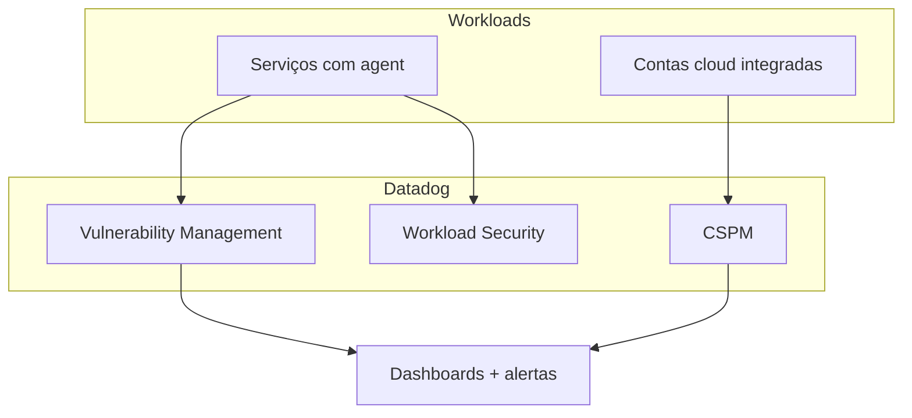
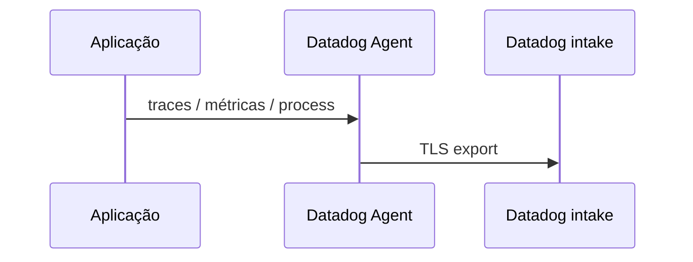
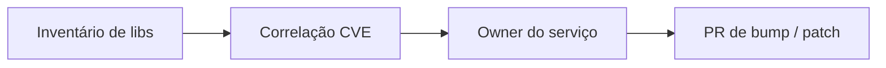
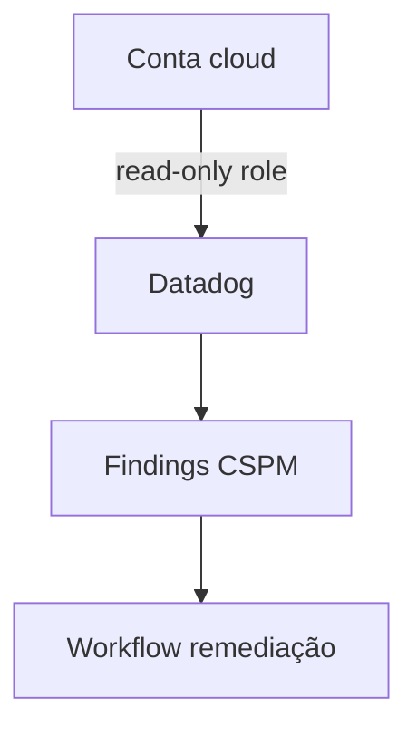
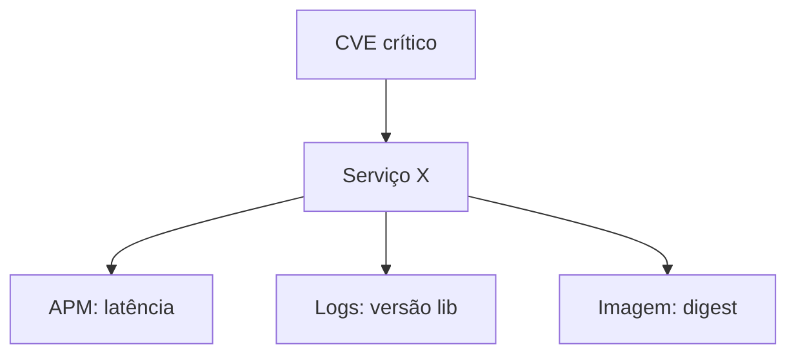

# Datadog — vulnerabilidades, postura na nuvem e uso em projeto

## Introdução

**Datadog** é uma plataforma de observabilidade que, no módulo de **Security**, oferece capacidades como **Software Composition Analysis (SCM/Vulnerability Management)** em serviços instrumentados, **Cloud Security Posture Management (CSPM)**, **Cloud Workload Security** e correlação com **APM**, **logs** e **infraestrutura**. Não substitui scanners OSS no **PR**, mas centraliza **inventário**, **priorização** e **tendência** em organizações que já padronizaram o agente.



> **Nota:** recursos exatos dependem de **contrato** e *SKUs*. Este artigo foca em **padrões de integração** e **laboratório** reproduzível.

---

## Pré-requisitos de projeto

1. Conta Datadog (trial ou corporativa).
2. **API Key** e **APP Key** com escopos mínimos para automação (preferir *scoped keys*).
3. Repositório com aplicação conteinerizada ou VM com agent.

---

## Instalação do Agent (Docker — laboratório)

O agent pode rodar como contêiner com variáveis `DD_API_KEY`, `DD_SITE` (ex.: `datadoghq.com` ou `datadoghq.eu`).

```yaml
# excerpt docker-compose — agent sidecar em lab
services:
  app:
    build: .
    environment:
      DD_AGENT_HOST: datadog-agent
    networks: [lab]

  datadog-agent:
    image: gcr.io/datadoghq/agent:7
    environment:
      DD_API_KEY: ${DD_API_KEY}
      DD_SITE: datadoghq.com
      DD_APM_ENABLED: "true"
      DD_DOGSTATSD_NON_LOCAL_TRAFFIC: "true"
      DD_PROCESS_AGENT_ENABLED: "true"
    volumes:
      - /var/run/docker.sock:/var/run/docker.sock:ro
      - /proc/:/host/proc/:ro
      - /sys/fs/cgroup/:/host/sys/fs/cgroup:ro
    networks: [lab]

networks:
  lab:
    driver: bridge
```



Em **Kubernetes**, o operador oficial ou Helm chart implanta *DaemonSet*; habilite **SBOM** / **ASM** conforme documentação da sua região e licença.

---

## Vulnerability Management (visão de uso)

Fluxo típico:

1. Agent ou integração coleta **bibliotecas** em runtime (ou CI envia metadados, conforme produto habilitado).
2. Datadog cruza com bases de **CVE**.
3. Times filtram por **serviço**, **ambiente**, **severidade** e **exploitability**.



**Boas práticas:** defina **SLA** por severidade; integre com **Jira** ou **ServiceNow** via webhooks.

---

## CSPM (postura)

Conecte contas **AWS**, **Azure** ou **GCP** com *read-only* IAM. O Datadog avalia *misconfigurations* (S3 público, SG aberto, etc.).



---

## Automação com API (exemplos mínimos)

### Python — listar hosts (infra API v1)

```python
import os
import urllib.request

def list_hosts() -> None:
    api_key = os.environ["DD_API_KEY"]
    app_key = os.environ["DD_APP_KEY"]
    req = urllib.request.Request(
        "https://api.datadoghq.com/api/v1/hosts?count=10",
        headers={"DD-API-KEY": api_key, "DD-APPLICATION-KEY": app_key},
    )
    with urllib.request.urlopen(req) as r:
        print(r.read().decode())

if __name__ == "__main__":
    list_hosts()
```

### Node.js — fetch com headers Datadog

```javascript
async function listHosts() {
  const res = await fetch("https://api.datadoghq.com/api/v1/hosts?count=10", {
    headers: {
      "DD-API-KEY": process.env.DD_API_KEY,
      "DD-APPLICATION-KEY": process.env.DD_APP_KEY,
    },
  });
  if (!res.ok) throw new Error(await res.text());
  console.log(await res.json());
}

listHosts().catch(console.error);
```

### Go — cliente HTTP genérico

```go
package main

import (
	"fmt"
	"io"
	"net/http"
	"os"
)

func main() {
	req, _ := http.NewRequest(http.MethodGet, "https://api.datadoghq.com/api/v1/hosts?count=5", nil)
	req.Header.Set("DD-API-KEY", os.Getenv("DD_API_KEY"))
	req.Header.Set("DD-APPLICATION-KEY", os.Getenv("DD_APP_KEY"))
	res, err := http.DefaultClient.Do(req)
	if err != nil {
		panic(err)
	}
	defer res.Body.Close()
	body, _ := io.ReadAll(res.Body)
	fmt.Println(string(body))
}
```

### C# — HttpClient

```csharp
using var client = new HttpClient { BaseAddress = new Uri("https://api.datadoghq.com/") };
client.DefaultRequestHeaders.Add("DD-API-KEY", Environment.GetEnvironmentVariable("DD_API_KEY")!);
client.DefaultRequestHeaders.Add("DD-APPLICATION-KEY", Environment.GetEnvironmentVariable("DD_APP_KEY")!);
var json = await client.GetStringAsync("api/v1/hosts?count=5");
Console.WriteLine(json);
```

### Java — `HttpClient` (Java 11+)

```java
var client = HttpClient.newHttpClient();
var req = HttpRequest.newBuilder(URI.create("https://api.datadoghq.com/api/v1/hosts?count=5"))
    .header("DD-API-KEY", System.getenv("DD_API_KEY"))
    .header("DD-APPLICATION-KEY", System.getenv("DD_APP_KEY"))
    .GET()
    .build();
var res = client.send(req, HttpResponse.BodyHandlers.ofString());
System.out.println(res.body());
```

---

## Correlação com observabilidade

Quando um **CVE** afeta um serviço, correlacione:

- **Throughput** e **latência** (APM) — deploy recente?
- **Logs** de *startup* — versão de runtime mudou?
- **Infra** — nova AMI ou imagem base?



---

## Projeto sugerido

1. Suba a API de laboratório com **agent** no mesmo compose.
2. Gere tráfego sintético (`curl` em loop).
3. No Datadog, localize o serviço e verifique **Service** → **Security** (conforme UI atual).

---

## Referências

- [Datadog Security](https://docs.datadoghq.com/security/)
- [Agent installation](https://docs.datadoghq.com/agent/)

---

*Datadog agrega **contexto operacional** aos achados de segurança — o ganho é priorização; o risco é **custos** e **complexidade** de licenciamento sem governança.*
