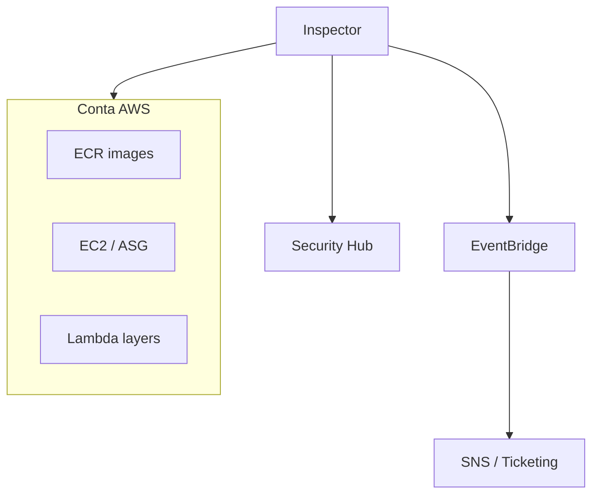
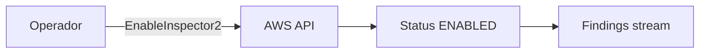
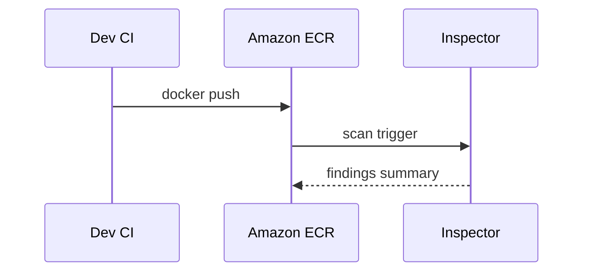
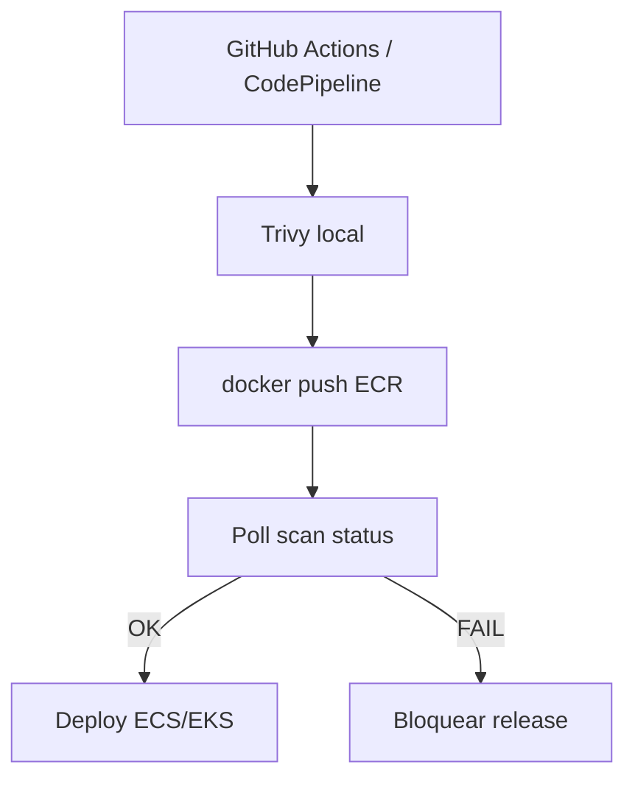

# AWS Inspector — achados na nuvem e fluxo com projeto

## Introdução

**Amazon Inspector** é um serviço **gerenciado** que avalia **vulnerabilidades** e, em conjunto com a configuração da conta, **exposição** em workloads **AWS** — incluindo **EC2**, **ECR** (*scan on push*), **Lambda** e análise contínua com integração a **Security Hub**, **EventBridge** e **SNS**. Diferente de scanners no laptop, o Inspector roda **na AWS** sobre o inventário real.



---

## Conceitos

| Conceito | Descrição |
|----------|-----------|
| **Finding** | Registro de CVE, redechability ou recomendação |
| **Scan on push** | ECR dispara análise ao enviar nova imagem |
| **SBOM** | Exportação de inventário (conforme recursos habilitados) |
| **Delegated admin** | Organizations — conta central de segurança |

---

## Habilitação (alto nível)

1. Ative **Inspector2** na região desejada (console ou API).
2. Confirme **IAM** e **Resource data sync** para EC2 (SSM agent / permissões de inventário — ver doc atual).
3. Em **ECR**, habilite **enhanced scanning** se quiser camada de pacotes com **Inspector**.



---

## Projeto: imagem no ECR + scan

### 1. Build local (espelho do que vai para a nuvem)

```bash
docker build -t minha-api:1.0.0 .
# Validação local complementar (OSS)
trivy image --severity HIGH,CRITICAL minha-api:1.0.0
```

### 2. Push para ECR

```bash
aws ecr get-login-password --region us-east-1 | docker login --username AWS --password-stdin "${ACCOUNT}.dkr.ecr.us-east-1.amazonaws.com"
docker tag minha-api:1.0.0 "${ACCOUNT}.dkr.ecr.us-east-1.amazonaws.com/minha-api:1.0.0"
docker push "${ACCOUNT}.dkr.ecr.us-east-1.amazonaws.com/minha-api:1.0.0"
```

Com **scan on push**, findings aparecem no console ECR e no **Inspector**.



---

## Ler findings via AWS CLI (exemplo)

> Comandos exatos variam com versão da API; use `aws inspector2 list-findings` conforme [documentação](https://docs.aws.amazon.com/inspector/).

```bash
aws inspector2 list-findings \
  --region us-east-1 \
  --filter-criteria '{"findingStatus":[{"comparison":"EQUALS","value":"ACTIVE"}]}' \
  --max-results 5
```

Para **ECR image scan** (API legada vs v2 — verifique qual sua conta usa):

```bash
aws ecr describe-image-scan-findings \
  --repository-name minha-api \
  --image-id imageTag=1.0.0 \
  --region us-east-1
```

---

## Automação em código

### Python — boto3 (listar findings v2)

```python
import boto3

def main() -> None:
    c = boto3.client("inspector2", region_name="us-east-1")
    r = c.list_findings(maxResults=10, filterCriteria={"findingStatus": [{"comparison": "EQUALS", "value": "ACTIVE"}]})
    for arn in r.get("findings", []):
        print(arn.get("findingArn"), arn.get("severity"), arn.get("title"))

if __name__ == "__main__":
    main()
```

### Node.js — AWS SDK v3

```javascript
import { Inspector2Client, ListFindingsCommand } from "@aws-sdk/client-inspector2";

const client = new Inspector2Client({ region: "us-east-1" });
const out = await client.send(
  new ListFindingsCommand({
    maxResults: 10,
    filterCriteria: { findingStatus: [{ comparison: "EQUALS", value: "ACTIVE" }] },
  }),
);
console.log(JSON.stringify(out.findings, null, 2));
```

### Go — SDK v2

```go
package main

import (
	"context"
	"fmt"
	"os"

	"github.com/aws/aws-sdk-go-v2/aws"
	"github.com/aws/aws-sdk-go-v2/config"
	"github.com/aws/aws-sdk-go-v2/service/inspector2"
)

func main() {
	cfg, err := config.LoadDefaultConfig(context.TODO())
	if err != nil {
		panic(err)
	}
	c := inspector2.NewFromConfig(cfg)
	out, err := c.ListFindings(context.TODO(), &inspector2.ListFindingsInput{
		MaxResults: aws.Int32(10),
	})
	if err != nil {
		panic(err)
	}
	for _, f := range out.Findings {
		fmt.Println(aws.ToString(f.Title), f.Severity)
	}
}
```

### Java — SDK v2

```java
import software.amazon.awssdk.regions.Region;
import software.amazon.awssdk.services.inspector2.Inspector2Client;
import software.amazon.awssdk.services.inspector2.model.*;

public class ListInspectorFindings {
  public static void main(String[] args) {
    try (var client = Inspector2Client.builder().region(Region.US_EAST_1).build()) {
      var resp = client.listFindings(
          ListFindingsRequest.builder().maxResults(10).build());
      resp.findings().forEach(f -> System.out.println(f.title() + " " + f.severity()));
    }
  }
}
```

### C# — AWS SDK for .NET

```csharp
using Amazon;
using Amazon.Inspector2;
using Amazon.Inspector2.Model;

var client = new AmazonInspector2Client(RegionEndpoint.USEast1);
var resp = await client.ListFindingsAsync(new ListFindingsRequest { MaxResults = 10 });
foreach (var f in resp.Findings)
    Console.WriteLine($"{f.Title} {f.Severity}");
```

---

## Integração com pipeline

1. **Build** → **scan local** (Trivy) → **push** ECR.
2. **Aguardar** conclusão do scan (polling `describe-image-scan-findings` ou *waiter*).
3. **Gate:** falhar se `CRITICAL` acima de política.



---

## Boas práticas

- Alinhar **Inspector** com **Security Hub** para visão única.
- Taggear recursos (`Environment`, `Owner`) para **filtrar findings**.
- Não duplicar **SLA** com scanner de CI — defina quem é **fonte da verdade** por tipo de risco.

---

## Referências

- [AWS Inspector User Guide](https://docs.aws.amazon.com/inspector/latest/user/)
- [ECR image scanning](https://docs.aws.amazon.com/AmazonECR/latest/userguide/image-scanning.html)

---

*Inspector transforma **inventário AWS** em **filas de remediação** — combine com scan no **PR** para não descobrir CVE só após o push.*
