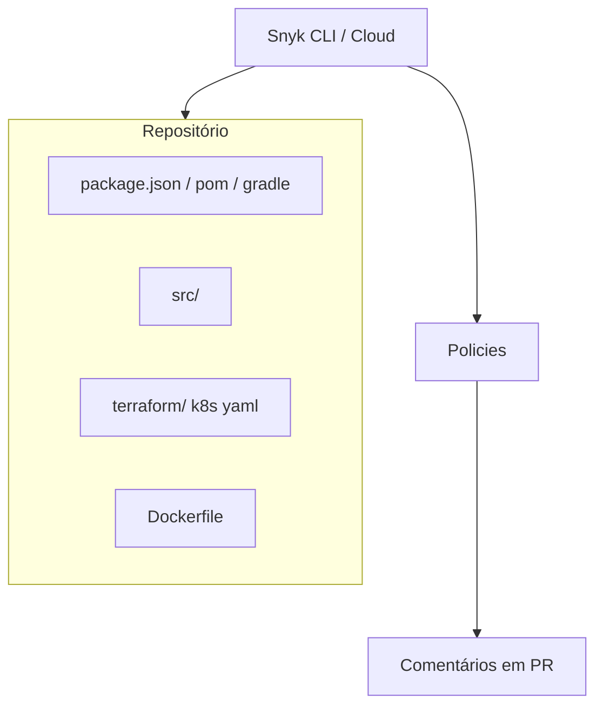
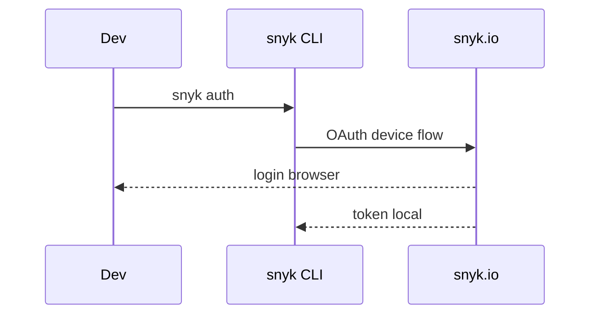
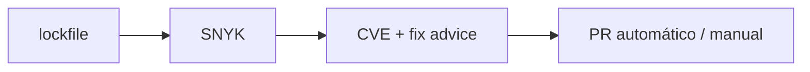
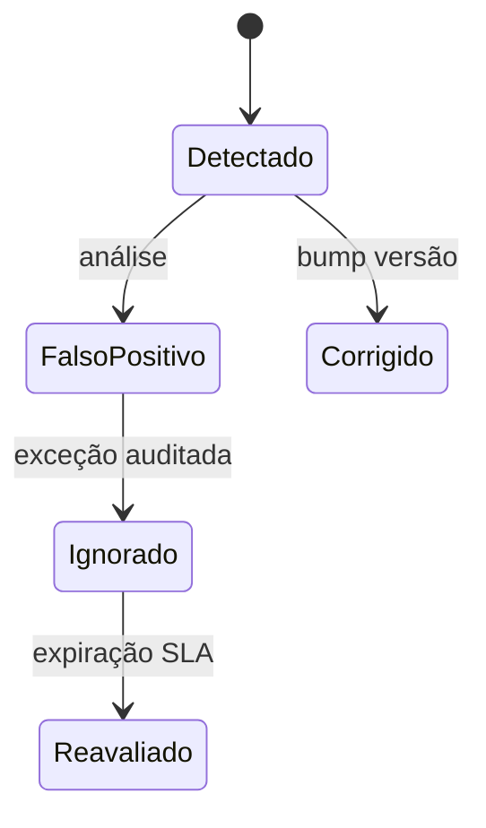

# Snyk — SCA, SAST, IaC e container no fluxo do projeto

## Introdução

**Snyk** é uma plataforma **comercial** (com camada **free tier** para projetos limitados) focada em **dependências (SCA)**, **código (SAST)**, **IaC** e **imagens de contêiner**. Integra-se a **GitHub/GitLab/Bitbucket**, **IDEs** e **CI**, aplicando **políticas** por organização — útil quando você precisa de **governança** central e **relatórios** para compliance.



---

## Instalação do CLI

### npm (multiplataforma)

```bash
npm install -g snyk
snyk --version
```

### Homebrew (macOS / Linux)

```bash
brew tap snyk/tap && brew install snyk
```

### Autenticação

```bash
snyk auth
```

Abre o browser para vincular o CLI à sua conta / org.



---

## Projeto de laboratório

Use um repositório Node ou Python com dependências conhecidas:

```text
snyk-lab/
├── package.json
├── package-lock.json
├── Dockerfile
└── .github/workflows/snyk.yml
```

---

## SCA — dependências

```bash
cd snyk-lab
snyk test --severity-threshold=high
```

- Gera relatório com **caminho de upgrade** sugerido.
- `snyk monitor` envia snapshot para o **dashboard** (útil em CI de *default branch*).



---

## Container

```bash
docker build -t snyk-lab:local .
snyk container test snyk-lab:local --file=Dockerfile
```

---

## IaC

```bash
snyk iac test ./terraform
```

---

## Integração CI — GitHub Actions (exemplo)

```yaml
name: snyk
on: [push, pull_request]
jobs:
  security:
    runs-on: ubuntu-latest
    steps:
      - uses: actions/checkout@v4
      - uses: snyk/actions/node@master
        env:
          SNYK_TOKEN: ${{ secrets.SNYK_TOKEN }}
        with:
          args: --severity-threshold=high
```

> Armazene `SNYK_TOKEN` como **secret** do repositório.

---

## Políticas e exceções

- **Ignore** com expiração no dashboard Snyk.
- **License policy** para OSS compliance (módulo separado).



---

## Exemplos em linguagens (automação ao redor do CLI)

### Python — subprocess com código de saída

```python
import subprocess
import sys

def run_snyk_test() -> int:
    return subprocess.call(["snyk", "test", "--severity-threshold=high", "--json-file-path=snyk.json"])

if __name__ == "__main__":
    sys.exit(run_snyk_test())
```

### Node.js — `execSync` em script npm

```json
{
  "scripts": {
    "security:snyk": "snyk test --severity-threshold=high"
  }
}
```

```javascript
import { execSync } from "node:child_process";
execSync("npm run security:snyk", { stdio: "inherit" });
```

### Go — wrapper

```go
package main

import (
	"os"
	"os/exec"
)

func main() {
	cmd := exec.Command("snyk", "test", "--severity-threshold=high")
	cmd.Stdout = os.Stdout
	cmd.Stderr = os.Stderr
	if err := cmd.Run(); err != nil {
		os.Exit(1)
	}
}
```

### Java — `ProcessBuilder`

```java
public int runSnyk() throws Exception {
  return new ProcessBuilder("snyk", "test", "--severity-threshold=high")
      .inheritIO()
      .start()
      .waitFor();
}
```

### C# — `Process.Start`

```csharp
using var p = Process.Start(new ProcessStartInfo
{
    FileName = "snyk",
    ArgumentList = { "test", "--severity-threshold=high" },
    RedirectStandardOutput = true,
    UseShellExecute = false,
});
var stdout = await p!.StandardOutput.ReadToEndAsync();
Console.WriteLine(stdout);
Environment.Exit(p.ExitCode);
```

---

## Quando preferir Snyk vs só Trivy

| Critério | Snyk | Trivy OSS |
|----------|------|-----------|
| Políticas corporativas | Forte | Você implementa |
| Custo | Licença | Grátis |
| PR comments / IDE | Nativo | Plugins variados |
| IaC + deps + imagem | Unificado | Unificado no Trivy |

---

## Referências

- [Snyk CLI](https://docs.snyk.io/snyk-cli)
- [Snyk for GitHub](https://docs.snyk.io/integrations/git-repository-s-scm-integrations/github-integration)

---

*Snyk acelera **remediação** com contexto de upgrade — combine com **revisão humana** para não confiar cegamente em bumps automáticos em libs centrais.*
