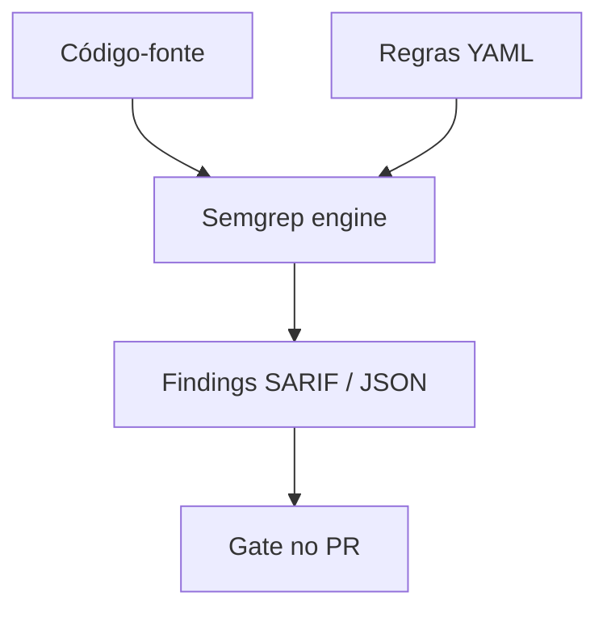
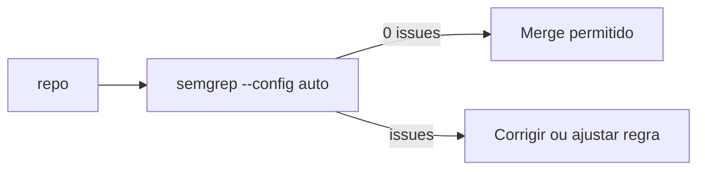
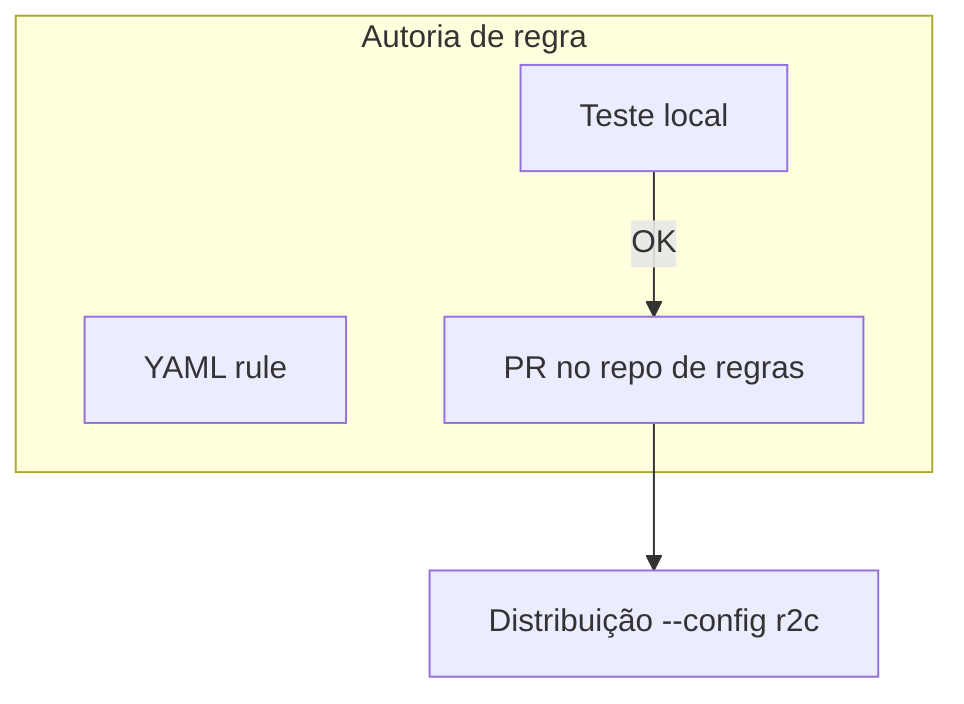
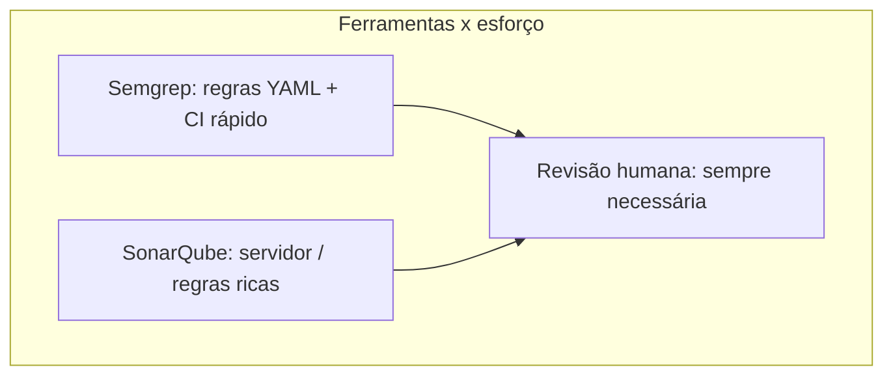

# Semgrep — SAST no PR, regras e projeto prático

## Introdução

**Semgrep** é um analisador estático **rápido** que funciona como **grep com AST**: você descreve padrões em YAML (**rules**) e o motor compara com árvores sintáticas de dezenas de linguagens. Há regras **OSS** (`p/security-audit`, `p/owasp-top-ten`), **regras custom** e **Semgrep Cloud** para políticas organizacionais.



---

## Instalação

### pip (Linux / macOS / WSL)

```bash
python3 -m pip install semgrep
semgrep --version
```

### Homebrew

```bash
brew install semgrep
```

### Docker (sem instalar Python)

```bash
docker run --rm -v "$PWD:/src" returntocorp/semgrep semgrep --config=auto /src
```

---

## Primeiro scan no projeto

Na raiz do repositório:

```bash
semgrep --config=auto --error
```

- `--config=auto` escolhe pacotes comuns (pode ser barulhento no início).
- `--error` retorna código ≠0 se houver *findings* — útil em CI.



---

## Projeto de laboratório

Crie um arquivo **intencionalmente fraco** para ver o Semgrep acionar (apenas em lab):

```python
# lab_vulnerable_sample.py — NÃO usar em produção
import pickle

def load_user_blob(data: bytes):
    return pickle.loads(data)  # unsafe deserialization
```

```javascript
// lab_vulnerable_sample.js — NÃO usar em produção
const exec = require("child_process").exec;
function run(name) {
  exec("ls " + name); // possible command injection pattern
}
```

Execute:

```bash
semgrep --config=p/security-audit lab_vulnerable_sample.py lab_vulnerable_sample.js
```

---

## Regra custom mínima (YAML)

Arquivo `semgrep-rules/no-eval.yml`:

```yaml
rules:
  - id: no-eval-javascript
    languages: [javascript, typescript]
    message: Evite eval — risco de injeção de código.
    severity: ERROR
    pattern: eval(...)
```

Rodar:

```bash
semgrep --config=semgrep-rules src/
```



---

## Integração CI — GitHub Actions

```yaml
name: semgrep
on: [pull_request, push]
jobs:
  scan:
    runs-on: ubuntu-latest
    steps:
      - uses: actions/checkout@v4
      - uses: returntocorp/semgrep-action@v1
        with:
          config: >-
            p/security-audit
            p/owasp-top-ten
```

Para **SARIF** no GitHub Security tab:

```bash
semgrep --config=auto --sarif --output=semgrep.sarif .
```

---

## Automação em várias linguagens

### Python — invocação programática (experimental / CLI preferido)

```python
import subprocess
import sys

def run_semgrep(path: str = ".") -> int:
    return subprocess.call(["semgrep", "--config=auto", "--error", path])

if __name__ == "__main__":
    sys.exit(run_semgrep())
```

### Node.js

```javascript
import { spawnSync } from "node:child_process";
const r = spawnSync("semgrep", ["--config=auto", "--error", "."], { stdio: "inherit" });
process.exit(r.status ?? 1);
```

### Go

```go
package main

import (
	"os"
	"os/exec"
)

func main() {
	cmd := exec.Command("semgrep", "--config=auto", "--error", ".")
	cmd.Stdout = os.Stdout
	cmd.Stderr = os.Stderr
	if err := cmd.Run(); err != nil {
		os.Exit(1)
	}
}
```

### Java

```java
public int runSemgrep() throws Exception {
  return new ProcessBuilder("semgrep", "--config=auto", "--error", ".")
      .inheritIO()
      .start()
      .waitFor();
}
```

### C#

```csharp
var p = Process.Start(new ProcessStartInfo
{
    FileName = "semgrep",
    ArgumentList = { "--config=auto", "--error", "." },
    UseShellExecute = false,
});
p!.WaitForExit();
Environment.Exit(p.ExitCode);
```

---

## Boas práticas

- Comece com **poucos packs** e aumente conforme o ruído diminui.
- **Separar** regras de **estilo** de regras de **segurança** (times diferentes).
- Versionar regras internas em **repositório dedicado** (`--config=https://...`).

---

## Semgrep vs SonarQube (visão rápida)

| Aspecto | Semgrep | SonarQube tradicional |
|---------|---------|------------------------|
| Velocidade no PR | Muito rápido | Depende do deploy |
| Regras custom | YAML AST | APIs/plugins mais pesados |
| Ecossistema enterprise | Cloud / Team | SQ server / cloud |



---

## Referências

- [Semgrep documentation](https://semgrep.dev/docs/)
- [Rule writing](https://semgrep.dev/docs/writing-rules/overview/)

---

*Semgrep é **ferramenta de time** quando as regras refletem **suas APIs proibidas** e **padrões inseguros** internos — o pack `auto` é só o ponto de partida.*
