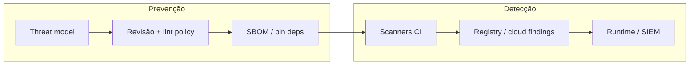
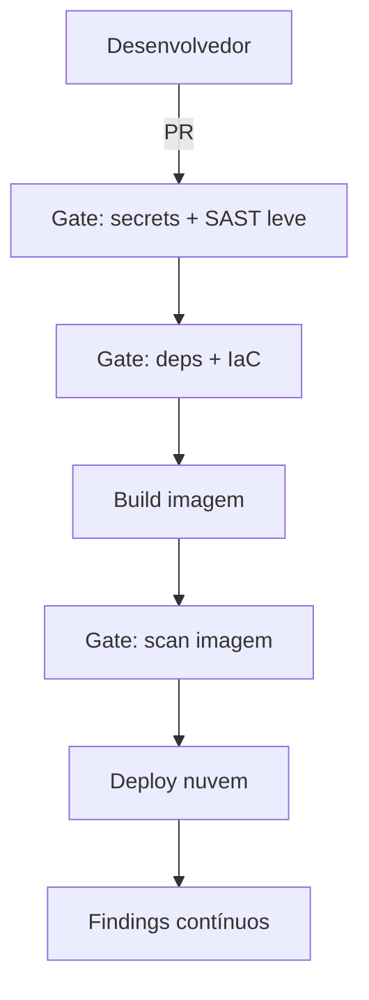
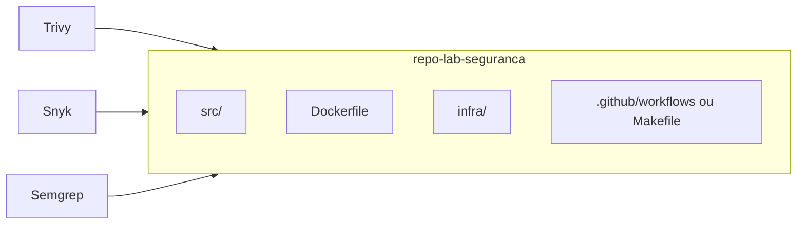

# Prevenção e detecção de vulnerabilidades

Esta sessão trata de **como reduzir risco** antes e depois do deploy: **prevenção** (design seguro, dependências atualizadas, configuração mínima, revisão de código) e **detecção** (scanners em CI, inventário de ativos, monitoramento de *findings* em nuvem e runtime). Os capítulos seguintes aprofundam **uma ferramenta por artigo**, com instalação, uso em **projeto de exemplo** e integração típica em pipeline.

---

## Por que separar prevenção e detecção?

Na prática, os mesmos dados alimentam os dois lados: **SBOM**, **CVE**, **CWE**, **misconfiguration** e **secrets** aparecem em relatórios de SCA (*Software Composition Analysis*), SAST, DAST e CSPM. A diferença está no **momento** e no **dono do feedback**:

| Momento | Foco de prevenção | Foco de detecção |
|---------|-------------------|------------------|
| **Design / PR** | Threat modeling, revisão, políticas | SAST, *secret scan*, política em IaC |
| **Build / imagem** | Base mínima, pin de versões | Scan de imagem, assinatura |
| **Deploy** | Least privilege, segmentação | CSPM, *drift*, Inspector |
| **Runtime** | Hardening, patches | RASP, workload security, alertas |

---

## Camadas de defesa (defesa em profundidade)

Nenhuma ferramenta substitui **cultura** e **processo**. Uma arquitetura comum em times maduros:

1. **Identidade** — MFA, roles curtas, sem chaves em repositório.
2. **Código** — SAST leve no PR; regras custom para o domínio.
3. **Dependências** — lockfile + scanner com **política de severidade** e exceções auditadas.
4. **Imagem / runtime** — usuário não-root, read-only rootfs quando possível, *distroless* ou bases atualizadas.
5. **Infra** — IaC revisado; *guardrails* na conta cloud.
6. **Resposta** — *playbooks*, owners por serviço, SLA de remediação.

---

## Ferramentas nesta sessão

| Capítulo | Papel típico |
|----------|----------------|
| [Trivy](./01-trivy.md) | Scanner OSS: imagem, filesystem, IaC, secrets — excelente no **CI** local |
| [Datadog](./02-datadog.md) | Plataforma comercial: **Vulnerability Management**, CSPM, correlação com APM |
| [AWS Inspector](./03-aws-inspector.md) | Findings gerenciados na **AWS** (EC2, ECR, Lambda, linguagens) |
| [Snyk](./04-snyk.md) | SCA/SAST/IaC/container com **políticas** e integração Git |
| [Semgrep](./05-semgrep.md) | SAST rápido com **regras** OSS e custom — ótimo no PR |

---

## Projeto “alvo” recomendado para laboratório

Para todos os capítulos, use **o mesmo repositório de estudo**:

- Uma API pequena (**Node**, **Python** ou **Java**) com `Dockerfile`.
- Pasta `infra/` com **Terraform** ou **Kubernetes** mínimo (1 deployment + service).
- `package-lock.json` / `poetry.lock` / `pom.xml` versionados.

Assim você compara **saída** (SARIF, JSON, tabela) entre ferramentas sem mudar o código a cada tutorial.

---

## Política de severidade e exceções

Defina em equipe:

- **Quais severidades bloqueiam merge** (ex.: CRITICAL + HIGH em *direct* deps).
- **Como registrar exceção** (ticket + `expires` + owner).
- **Como retestar** após *upstream* publicar patch.

Sem isso, scanners viram **ruído** ou **bypass** informal.

---

## Leitura cruzada

- [DevOps — DevSecOps](../devops/01-conceitos-devops-devsecops.md)
- [Melhores práticas — segurança e performance](../melhores-praticas-desenvolvimento/06-seguranca-e-performance.md)
- [Observabilidade estendida — Grafana e Zabbix](../observabilidade-estendida/README.md)

---

## Referências gerais

- [OWASP DevSecOps Guideline](https://owasp.org/www-project-devsecops-guideline/)
- [NIST SSDF](https://csrc.nist.gov/Projects/ssdf)
- [CVE](https://www.cve.org/) · [CWE](https://cwe.mitre.org/)

---

*Prevenção **barata** no PR; detecção **contínua** na nuvem — juntas reduzem o custo médio de incidente.*
