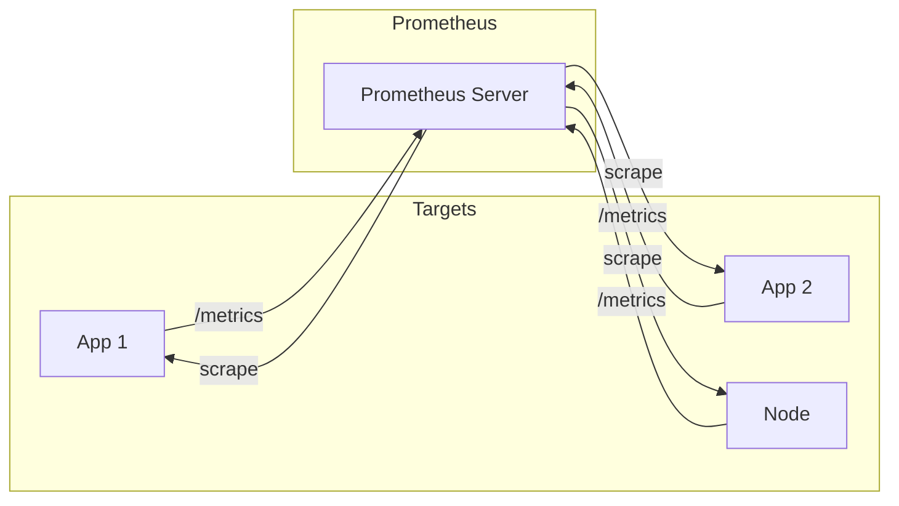

# Conceitos e modelo de métricas no Prometheus

## O que é o Prometheus?

**Prometheus** é um sistema de **monitoramento** e banco de **séries temporais** (time series): coleta métricas de alvos (aplicações, nós, serviços) via **pull** (HTTP), armazena em disco e permite consultas (PromQL) e alertas. É amplamente usado para observabilidade de infraestrutura e aplicações (Kubernetes, containers, APIs). Faz parte do ecossistema Cloud Native (CNCF).

## Modelo de dados: séries temporais

Cada **métrica** é identificada por **nome** e **labels** (pares chave=valor). Uma **série temporal** é a sequência de (timestamp, valor) para uma combinação nome + labels. Exemplo:

- Nome: `http_requests_total`
- Labels: `method="GET"`, `path="/api/users"`, `status="200"`
- Série: (t1, 10), (t2, 12), (t3, 15) …

Labels permitem filtrar e agregar (ex.: soma de requests por path, taxa de erro por método). Convenção: sufixo **\_total** para contadores, **\_bucket** para histogramas.

## Tipos de métricas

| Tipo | Descrição | Uso |
|------|-----------|-----|
| **Counter** | Monotonicamente crescente (total de requests, erros). | Taxas (rate, increase) no PromQL. |
| **Gauge** | Valor que sobe ou desce (conexões ativas, uso de memória). | Valor atual ou médias. |
| **Histogram** | Amostra observações em buckets; conta e soma. | Latência (p50, p95, p99), distribuição. |
| **Summary** | Similar ao histogram; quantis calculados no client. | Latência quando o client pode calcular quantis. |

Aplicações expõem métricas em um endpoint **/metrics** (formato texto); o Prometheus faz **scrape** (pull) nesse endpoint em intervalo configurável (ex.: 15s).

## Observabilidade: o que monitorar

- **RED** (para serviços request-driven): **R**ate (requests/s), **E**rrors (taxa de erro), **D**uration (latência).
- **USE** (para recursos): **U**tilization, **S**aturation, **E**rrors.
- **SLI/SLO** – Indicadores de nível de serviço (ex.: disponibilidade 99,9%, latência p99 < 200 ms); o Prometheus alimenta o cálculo e os alertas quando o SLO é violado.
- **Golden signals** – Latência, tráfego, erros, saturação; métricas de aplicação (requests, latência, erros) e de infra (CPU, memória, disco).

O Prometheus não substitui logs nem traces; complementa com métricas numéricas agregáveis e consultas em tempo real.

## Resumo

| Conceito | Descrição |
|----------|-----------|
| **Pull** | Prometheus busca métricas nos targets (HTTP /metrics). |
| **Série** | Nome + labels + (timestamp, valor). |
| **Counter / Gauge / Histogram** | Tipos para contagem, estado atual e distribuição. |
| **Observabilidade** | RED, USE, SLI/SLO; métricas como base para alertas e dashboards. |

No próximo capítulo: configuração de scrape, exportadores (Node, cAdvisor, aplicação), e introdução ao PromQL.

---

*Próximo: [Coleta, exportadores e PromQL](./02-coleta-promql.md).*
