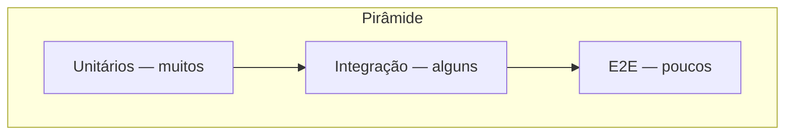

# Pirâmide de testes, tipos e regressão

## Os três níveis habituais

| Tipo | O que valida | Velocidade típica | Quantidade típica |
|------|----------------|-------------------|-------------------|
| **Unitário** | Funções/classes isoladas com dependências substituídas (*mocks/stubs*) | Milissegundos | Maioria dos testes |
| **Integração** | Componentes reais trabalhando juntos (serviço + BD em container, API + HTTP real) | Segundos | Moderada |
| **E2E (*end-to-end*)** | Fluxo como o utilizador (browser ou cliente HTTP contra sistema deployado) | Minutos | Poucos, bem escolhidos |

**Erro comum:** substituir integração por centenas de E2E — CI lento e *flakes* por timing de rede/UI.

---

## Unitário vs integração — fronteira útil

- **Unitário:** não sobe servidor; não usa rede real nem ficheiros aleatórios sem controlo; falhas localizam *linha de negócio*.
- **Integração:** sobe parte do sistema (ex.: Postgres via Docker); valida SQL, migrações, serializers em conjunto.

**Duplicidade aceitável:** um caso unitário da regra de negócio **e** um integrado que persiste na BD podem coexistir — o primeiro dá feedback instantâneo; o segundo apanha erros de mapeamento/rede.

---

## Testes regressivos (*regression*)

**Regressão** não é um “tipo” diferente de *runner*: é **garantir que comportamento antigo continua correto** após mudanças.

- **Suíte regressiva** = conjunto de testes (normalmente unit + integração + alguns E2E) executada em **cada PR ou merge**.
- **Teste de regressão visual** (*snapshot* de UI — Storybook + testes de imagem, ou Playwright *screenshot*): detecta mudanças não intencionais no *layout*.

**Prática:** etiquetar testes críticos (`@smoke`, `@contract`) para correr primeiro em CI e falhar rápido.

---

## Contratos e testes de contrato (*consumer-driven*)

Em microserviços, **testes de contrato** (ex.: **Pact**) garantem que o produtor não quebra expectativas do consumidor — são uma forma de **regressão de API** entre equipas.

---

## Nomenclatura: Arrange, Act, Assert

Independentemente da linguagem, estrutura clara:

1. **Arrange** — preparar dados e *mocks*.
2. **Act** — invocar o código sob teste.
3. **Assert** — verificar resultado ou exceção.

Os capítulos seguintes aplicam este padrão em **pytest**, **Jest** e **JUnit 5**.

---

## Referências

- [Martin Fowler — TestPyramid](https://martinfowler.com/bliki/TestPyramid.html)
- [Google Testing Blog — Flaky tests](https://testing.googleblog.com/2016/12/flaky-tests-at-google-and-what-we-do.html)
- [Pact — Consumer-driven contracts](https://docs.pact.io/)

---

*A pirâmide é um **guião**: em domínios com muita regra em SQL ou integrações, a “base” pode incluir mais integração do que o desenho clássico sugere.*
