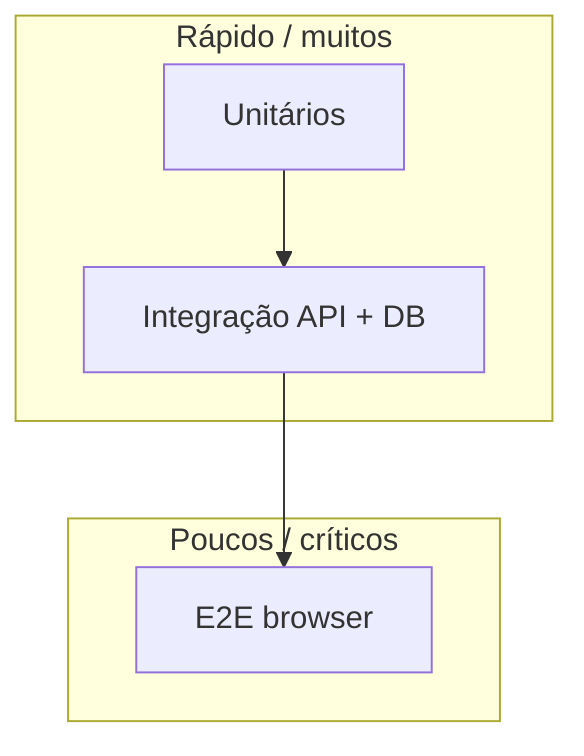

# Qualidade e testes

Esta sessão cobre **estratégia de testes** (pirâmide, unitários, integração, regressão) e **automação de UI** com **Playwright**, **Cypress** e **Selenium**. Os capítulos trazem **exemplos executáveis** nas três stacks pedidas — **Python**, **Node.js** e **Java** — sempre que a ferramenta o suportar.

---

## Por que esta ordem?

1. Entender **tipos de teste** e **regressão** evita investir só em E2E lento ou só em mocks desconectados do mundo real.
2. **Unitários + integração** dão feedback rápido em CI; **E2E** confirma fluxos críticos que cruzam front, API e cookies.
3. **Playwright**, **Cypress** e **Selenium** competem parcialmente: escolha por **runtime** (ex.: já és full JS → Cypress/Playwright), **ecossistema** (.NET/Python teams costumam gostar de Playwright), ou **legado Selenium**.

---

## Índice

1. [Pirâmide, tipos de teste e regressão](./01-piramide-tipos-regressao.md)
2. [Testes unitários: Python, Node.js, Java](./02-testes-unitarios-python-node-java.md)
3. [Integração e testes regressivos](./03-integracao-testes-regressivos.md)
4. [Playwright](./04-playwright.md)
5. [Cypress](./05-cypress.md)
6. [Selenium WebDriver](./06-selenium.md)

---

## Estudos relacionados

- [Melhores práticas — Testes e qualidade](../melhores-praticas-desenvolvimento/04-testes-e-qualidade.md) — visão compacta e boas práticas.
- [Frontend](../frontend/README.md) — contexto dos testes no browser.
- [DevOps](../devops/README.md) — pipelines e gates de qualidade.

---

*Testes são **contratos** sobre o comportamento esperado; ferramentas mudam, a **intenção** mantém-se.*
