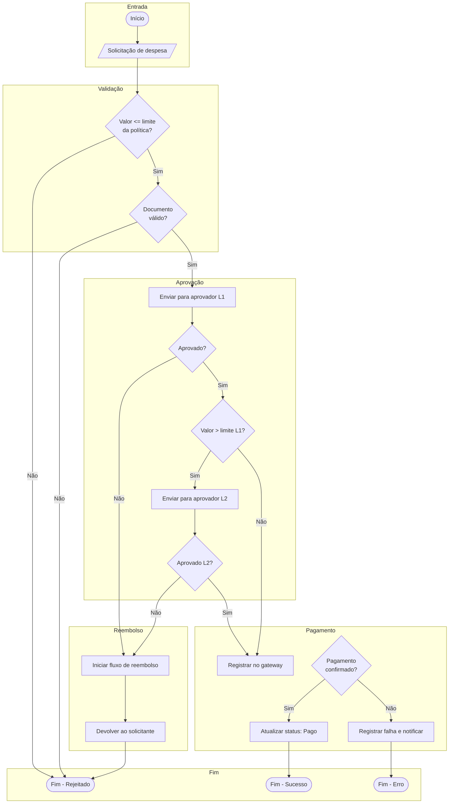

# Fluxograma: símbolos e cenários complexos

## Índice de símbolos – Fluxograma (notação comum)

Na notação clássica de fluxograma (e equivalentes em Mermaid/flowchart), cada forma tem um papel definido. Abaixo, o **índice de imagens/símbolos** com uso e significado.

| Símbolo (forma) | Nome | Uso | Significado |
|------------------|------|-----|-------------|
| **Retângulo** | Processo / Ação | Uma etapa de processamento ou comando executável | “O que é feito”: cálculo, chamada de serviço, escrita em banco, transformação de dados. |
| **Retângulo arredondado** | Início / Fim | Pontos de entrada e saída do fluxo | Início (trigger) ou término (sucesso, fim do caso de uso). |
| **Losango / diamante** | Decisão | Condição que ramifica o fluxo | Pergunta sim/não; ramos distintos conforme o resultado (ex.: válido?, há estoque?). |
| **Paralelogramo** | Entrada / Saída de dados | Leitura ou escrita de dados externos | Input (formulário, mensagem, API) ou output (relatório, resposta, evento). |
| **Cilindro** | Armazenamento / Base de dados | Persistência ou armazenamento | Banco de dados, arquivo, fila, cache. |
| **Círculo pequeno** | Conector (dentro da página) | Continuação do fluxo na mesma página | Evita cruzar setas; “continua em A”. |
| **Círculo com letra/número** | Conector (entre páginas) | Referência a outro trecho ou página | “Ver fluxo na página 2” ou “continua no conector B”. |
| **Setas** | Fluxo / Controle | Ordem de execução e direção | Indica qual passo vem a seguir; pode ser rotulada (ex.: “sim”, “não”, “erro”). |
| **Retângulo com listras** | Documento | Entrada ou saída em formato documento | Relatório, contrato, PDF, planilha gerada. |
| **Retângulo duplo (lateral)** | Subrotina / Processo pré-definido | Chamada a outro fluxo ou módulo | Reuso: “chamar validação de CPF”, “executar regra X”. |
| **Trapézio** | Operação manual | Ação feita por pessoa | Aprovação manual, digitação, inspeção. |
| **Hexágono** | Preparação | Inicialização ou ajuste de parâmetros | Setup, definição de variáveis, preparar ambiente para o processo. |
| **Forma “bomba” / asimétrica** | Delay / Espera | Tempo de espera ou atraso | Aguardar resposta externa, timeout, fila. |

Em **Mermaid** (flowchart), as formas mais usadas são: `[ ]` retângulo, `( )` arredondado, `{ }` losango, `[[ ]]` subrotina, `[( )]` cilindro; subgrafos agrupam blocos lógicos.

---

## Exemplo complexo: Fluxo de aprovação de despesa com reembolso e exceções

Cenário real: **aprovação de despesa** com múltiplos níveis, regras de valor, reembolso em caso de rejeição, integração com gateway de pagamento e tratamento de timeout e inconsistência.

**Leitura do fluxo:** Entrada (solicitação) → validação de valor e documento → envio ao aprovador L1; se aprovado e valor acima do limite L1, sobe para L2. Rejeição em qualquer nível dispara reembolso e fim “Rejeitado”. Aprovação segue para registro no gateway; se o pagamento não for confirmado, registra falha e termina em “Erro”. Decisões (losangos) representam regras de negócio e ramos de exceção; retângulos são processos; início e fim são arredondados.

---

*Próximo: [Diagrama de sequência: símbolos e cenários complexos](./04-diagrama-sequencia.md).*
