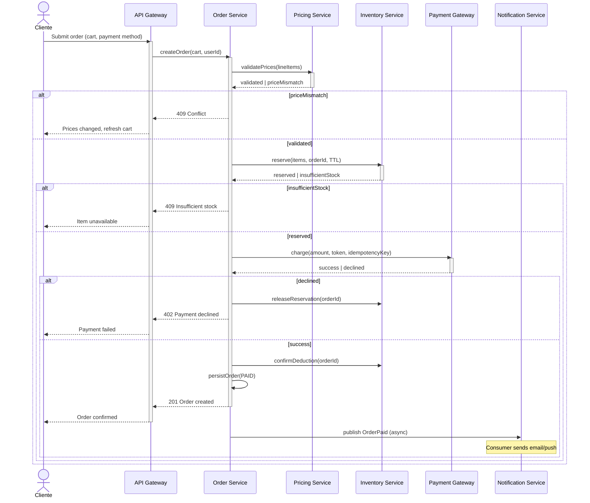

# Diagrama de sequência: símbolos e cenários complexos

## Índice de símbolos – Diagrama de sequência (UML / Mermaid)

O diagrama de sequência mostra **atores e objetos** em linhas de vida e **mensagens** no tempo. Abaixo, o **índice de elementos** com uso e significado.

| Símbolo / Elemento | Nome | Uso | Significado |
|--------------------|------|-----|-------------|
| **Lifeline (linha vertical)** | Linha de vida | Coluna abaixo de cada participante | Tempo; a ordem vertical indica ordem de ocorrência dos eventos. |
| **Ator (stick figure)** | Ator | Participante externo (usuário, sistema externo) | Quem ou o que inicia ou recebe a interação fora do sistema. |
| **Retângulo sobre lifeline** | Objeto / Participante | Componente do sistema (serviço, classe, processo) | Instância que envia ou recebe mensagens. |
| **Seta cheia →** | Mensagem síncrona | Chamada que bloqueia até retorno | Request/response; o chamador espera (ex.: chamada de função, HTTP síncrono). |
| **Seta tracejada -->** | Mensagem assíncrona | Envio sem espera de resposta | Fire-and-forget, evento, publicação em fila. |
| **Seta tracejada de volta** | Retorno / Resposta | Resposta à mensagem síncrona | Valor de retorno ou confirmação; alinhado à mensagem que provocou. |
| **Retângulo alongado na lifeline** | Ativação (activation box) | Período em que o objeto está processando | Janela de tempo em que o objeto está “ocupado” tratando a mensagem. |
| **Retângulo com [ ]** | Fragmento (alt, opt, loop) | Condição ou iteração | **alt**: ramos condicionais; **opt**: um ramo opcional; **loop**: repetição. |
| **Nota lateral** | Comentário | Explicação ou pré/pós-condição | Texto livre para esclarecer regra, invariante ou decisão. |
| **X no fim da lifeline** | Destruição | Fim da existência do objeto | Objeto deixa de existir após aquele ponto (menos comum em serviços). |
| **Seta que se volta ao mesmo objeto** | Auto-chamada | Mensagem para si mesmo | Chamada interna (método chamando outro método do mesmo objeto). |

Em **Mermaid** (sequenceDiagram): `participant`, `actor`, `->` (sólida), `-->` (tracejada), `->>+` (ativação), `-->>-` (retorno); `alt/else/end`, `opt/end`, `loop/end` para fragmentos.

---

## Exemplo complexo: Checkout com pagamento, estoque e notificação

Cenário real: **checkout** envolvendo API Gateway, serviço de pedido, validação de preço, reserva de estoque, gateway de pagamento, confirmação de estoque e notificação (evento assíncrono). Inclui ramos de erro (pagamento recusado, estoque insuficiente) e rollback.

**Leitura:** Cliente envia o pedido ao Gateway; Order Service valida preços (síncrono). Se houver divergência, retorna 409. Se ok, reserva estoque; se insuficiente, 409. Em seguida cobra no gateway de pagamento; se recusado, libera reserva e retorna 402. Se aprovado, confirma dedução de estoque, persiste pedido pago e responde 201; em paralelo publica evento assíncrono para notificação. Ativações (activate/deactivate) mostram quando cada participante está “ocupado”; alt indica ramos condicionais reais do fluxo.

---

*Próximo: [Diagrama de estados: símbolos e cenários complexos](./05-diagrama-estados.md).*
