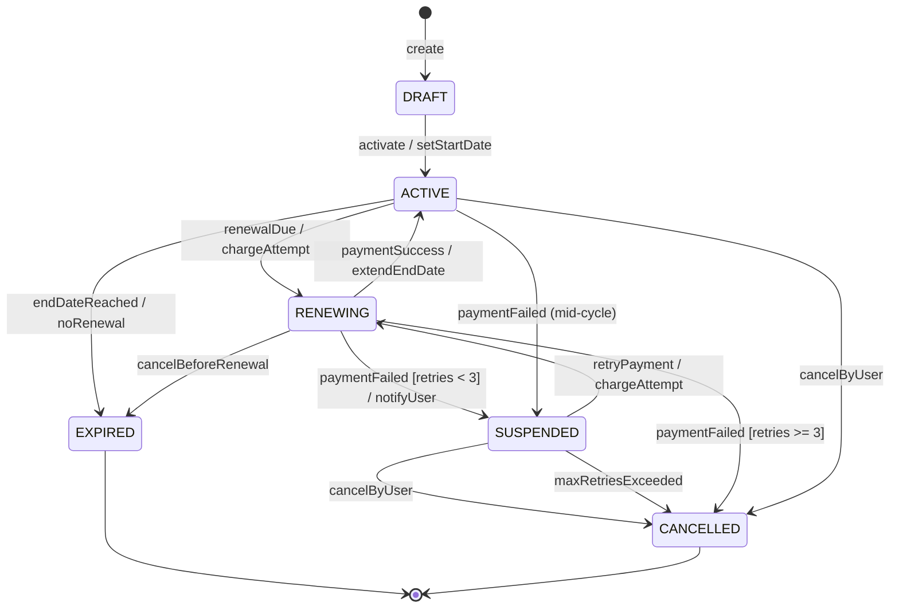

# Diagrama de estados: símbolos e cenários complexos

## Índice de símbolos – Diagrama de estados (UML / Mermaid)

O diagrama de estados representa **estados** de um mesmo objeto e **transições** disparadas por eventos ou condições. Abaixo, o **índice de elementos** com uso e significado.

| Símbolo / Elemento | Nome | Uso | Significado |
|--------------------|------|-----|-------------|
| **Retângulo arredondado** | Estado (simple state) | Um valor estável do objeto | Condição em que o objeto permanece até ocorrer um evento (ex.: PENDING, PAID, SHIPPED). |
| **Círculo sólido (preenchido)** | Estado inicial (initial) | Ponto de entrada do diagrama | Único; de onde o objeto “nasce” no fluxo. |
| **Círculo com borda (target)** | Estado final (final) | Término da vida do objeto ou do fluxo | Pode haver mais de um (ex.: COMPLETED, CANCELLED). |
| **Seta entre estados** | Transição | Mudança de um estado para outro | Disparada por **evento [guard]** ou **evento / ação**. |
| **Rótulo na transição: evento** | Evento (trigger) | Nome do que provoca a transição | Ex.: paymentReceived, timeout, cancelRequest. |
| **Rótulo: [condição]** | Guard (guard condition) | Condição que deve ser verdadeira | A transição só ocorre se a guard for verdadeira (ex.: [amount > 0]). |
| **Rótulo: / ação** | Ação (effect) | Comportamento executado na transição | Ex.: / sendConfirmation, / releaseStock(). |
| **Retângulo dentro de estado** | Atividade interna (entry/exit/do) | entry:, exit:, do: | entry: ao entrar no estado; exit: ao sair; do: atividade contínua enquanto no estado. |
| **Losango (dentro do diagrama)** | Decisão (choice) | Pseudoestado que ramifica | Várias transições saem com guards mutuamente exclusivas. |
| **Círculo com H** | Histórico (shallow history) | Lembrar último subestado ativo | Ao reentrar no estado composto, restaura o último subestado. |
| **Estado com divisória** | Estado composto (composite) | Estado com subestados | Contém outros estados; pode ter região paralela (fork/join). |
| **Barra grossa** | Fork / Join | Paralelismo | Fork: uma transição se divide em várias; Join: várias transições convergem. |

Em **Mermaid** (stateDiagram-v2): `[*]` inicial/final, `-->` transição, `state "Nome" as id`, `note right of state`. Guards e ações podem ser anotados na seta.

---

## Exemplo complexo: Máquina de estados de assinatura (subscription) com renovação e falha

Cenário real: **assinatura** de um produto/serviço com estados: rascunho, ativa, em renovação, suspensa (falha de pagamento), cancelada, expirada. Transições: ativação, tentativa de cobrança, sucesso/falha, retry, cancelamento e expiração por inatividade.

**Leitura:** Do rascunho só se vai para ativo (ativar). Ativo pode: entrar em renovação (cobrança), ir para suspensa (falha de pagamento) ou expirada (fim de vigência sem renovação) ou cancelada (usuário). Em renovação: sucesso volta a ativo; falha com retries < 3 vai para suspensa; com retries ≥ 3 vai para cancelada. Suspensa pode ter retry (volta a renovando), cancelamento pelo usuário ou por exceder retries (cancelada). Estados finais são expirada e cancelada. As labels nas setas indicam evento, guard e ação, alinhados ao índice de símbolos acima.

---

*Próximo: [UML: visões e diagramas em cenários reais](./06-uml.md).*
