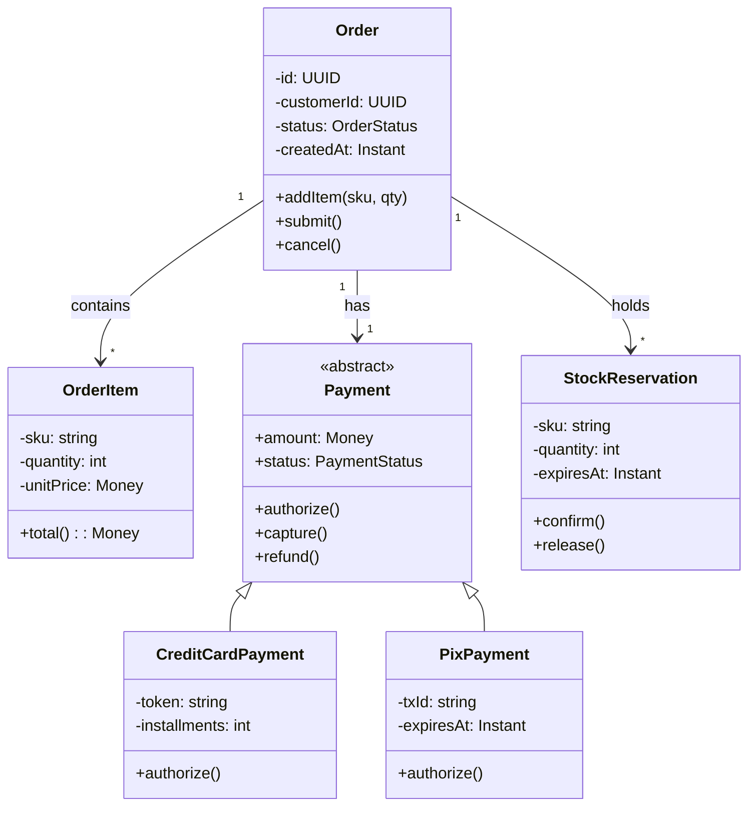

# UML: visões e diagramas em cenários reais

## Visão geral da UML e tipos de diagrama

A **UML (Unified Modeling Language)** agrupa diagramas em **estrutura** (o que existe) e **comportamento** (o que acontece). Em cenários reais, escolhemos o tipo conforme a dúvida: estrutura estática (classes, componentes), interação no tempo (sequência), ciclo de vida (estados) ou uso (casos de uso).

| Categoria | Diagrama | Uso principal |
|-----------|----------|----------------|
| Estrutura | **Classe** | Entidades, atributos, associações, herança, agregação, composição. |
| Estrutura | **Objeto** | Snapshot de instâncias em um momento (menos usado). |
| Estrutura | **Componente** | Módulos, interfaces expostas e dependências. |
| Estrutura | **Composite structure** | Partes internas de um componente e conectores. |
| Estrutura | **Deployment** | Artefatos e nós de execução (servidores, containers). |
| Comportamento | **Caso de uso** | Atores e casos de uso (funcionalidades do sistema). |
| Comportamento | **Sequência** | Ordem de mensagens entre objetos no tempo. |
| Comportamento | **Estados** | Máquina de estados de um objeto. |
| Comportamento | **Atividade** | Fluxo de trabalho (similar a fluxograma com raias). |

---

## Índice de símbolos – Diagrama de classes (UML)

| Símbolo / Elemento | Nome | Uso | Significado |
|--------------------|------|-----|-------------|
| **Retângulo com 3 compartimentos** | Classe | Nome, atributos, operações | Tipo de objeto: nome no topo; atributos (tipo, visibilidade); métodos. |
| **+ / - / #** | Visibilidade | Antes de atributo ou operação | + público; - privado; # protegido; ~ pacote. |
| **Linha sólida entre classes** | Associação | Relação entre classes | “Conhece” ou “usa”; pode ter multiplicidade (1, *, 0..1) e nome da role. |
| **Seta oco (triângulo)** | Generalização | Herança | Subclasse herda de superclasse (ex.: Payment ← CreditCardPayment). |
| **Linha com losango vazio** | Agregação | Todo-parte (fraca) | Parte pode existir sem o todo (ex.: Time tem jogadores). |
| **Linha com losango preenchido** | Composição | Todo-parte (forte) | Parte não existe sem o todo; ciclo de vida ligado (ex.: Pedido tem Itens). |
| **Linha tracejada com seta** | Dependência | “Usa” pontual | Uma classe usa outra (parâmetro, criação local); não associação permanente. |
| **Círculo conectado por linha** | Interface | Contrato | Classe realiza interface (implementa); interface pode ser “lollipop”. |
| **&lt;&lt;stereotype&gt;&gt;** | Estereótipo | Categorização | &lt;&lt;entity&gt;&gt;, &lt;&lt;service&gt;&gt;, &lt;&lt;controller&gt;&gt;. |

---

## Exemplo complexo: Domínio de pedidos com pagamento e estoque

Cenário real: **pedido** com itens, múltiplas formas de **pagamento** (herança: cartão, boleto, PIX), **estorno** e **reserva de estoque** com validade. Diagrama de classes simplificado em Mermaid (Mermaid não suporta todos os símbolos UML; a tabela acima vale como referência para desenho em ferramentas completas).

**Leitura:** Order agrega OrderItem (composição na UML) e tem um Payment (abstrato); CreditCardPayment e PixPayment são especializações. Order mantém StockReservation(s) com validade; operações confirm() e release() refletem confirmação de dedução ou devolução. Em ferramentas UML completas, multiplicidades (1, *), composição (losango preenchido) e estereótipos seriam usados conforme o índice acima.

---

*Próximo: [Diagrama entidade-relacionamento: símbolos e modelos complexos](./07-diagrama-er.md).*
