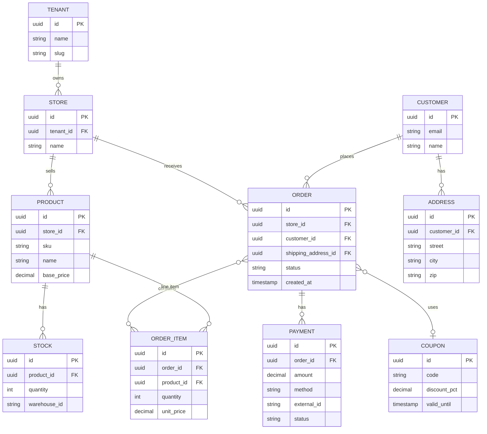

# Diagrama entidade-relacionamento: símbolos e modelos complexos

## Índice de símbolos – Diagrama ER (notação Crow's Foot / Chen)

O diagrama **entidade-relacionamento** modela **entidades** (tabelas), **atributos** e **relacionamentos** com cardinalidade. Abaixo, o **índice de elementos** com uso e significado.

| Símbolo / Elemento | Nome | Uso | Significado |
|--------------------|------|-----|-------------|
| **Retângulo** | Entidade | “Tabela” ou tipo de objeto do domínio | Ex.: Cliente, Pedido, Produto. Representa um conjunto de instâncias. |
| **Elipse / oval** | Atributo | Campo ou coluna da entidade | Ligado à entidade; pode ser **chave** (sublinhado), **obrigatório** ou opcional. |
| **Losango** | Relacionamento | Associação entre entidades | Nome do relacionamento (ex.: “faz”, “contém”, “pertence_a”). |
| **Linha com cardinalidade** | Cardinalidade | Quantidade de um lado da relação | **1** (exatamente um), **0..1** (zero ou um), **\*** ou **n** (muitos), **1..\*** (um ou muitos). |
| **Pé de galinha (Crow's Foot)** | “Muitos” | Três traços no lado da entidade | O outro lado da relação tem múltiplas instâncias (ex.: um Pedido tem muitos Itens). |
| **Barra perpendicular** | “Um” (obrigatório) | Uma linha | O outro lado tem exatamente uma instância e é obrigatório. |
| **Círculo (na linha)** | Opcional | Zero ou um | A participação do outro lado é opcional (0..1). |
| **Chave primária (PK)** | Identificador | Atributo(s) que identificam a entidade | Sublinhado ou marcado como PK; garante unicidade. |
| **Chave estrangeira (FK)** | Referência | Atributo que referencia PK de outra entidade | Estabelece o relacionamento no modelo físico; integridade referencial. |
| **Atributo composto** | Agrupamento de atributos | Conjunto de atributos com significado único | Ex.: Endereço (rua, número, CEP, cidade); pode ser normalizado em entidade separada. |
| **Atributo multivalorado** | Múltiplos valores | Um atributo com vários valores por entidade | Normalização: virar entidade fraca ou tabela associativa. |
| **Entidade fraca** | Entidade sem PK própria | Depende de outra entidade para identificação | Retângulo duplo; chave parcial + PK da entidade “dona”. |
| **Herança / Especialização** | Subentidade | Subconjunto com atributos específicos | Triângulo ou “ISA”; ex.: Pagamento ← Cartao, Boleto, Pix. |

Em **Mermaid** (erDiagram): entidades com atributos entre chaves; relacionamento com `|o--o|` (opcional-opcional), `||--o|` (1 para 0..1), `||--||` (1 para 1), `}o--o|` (muitos para muitos), etc. Legenda: `|o` zero ou um, `||` exatamente um, `}o` zero ou muitos, `}|` um ou muitos.

---

## Exemplo complexo: Modelo ER para e-commerce multi-tenant com pedidos, pagamentos e catálogo

Cenário real: **multi-tenant** (lojas); **catálogo** por loja com SKU, preço e estoque; **pedidos** com itens, **pagamentos** (um pedido pode ter mais de um pagamento: parcela, reembolso parcial); **cliente** e **endereço**; **cupom** e **regra de preço** por canal.

**Leitura:** TENANT possui várias STORE; STORE vende PRODUCT e recebe ORDER. PRODUCT tem STOCK (por warehouse). CUSTOMER tem ADDRESS e faz ORDER; ORDER contém ORDER_ITEM (N:N com atributos na tabela de junção), tem um ou mais PAYMENT e pode usar COUPON. Chaves PK/FK e cardinalidades (|| 1, o{ 0 ou muitos, }o muitos) seguem o índice de símbolos; em modelo físico, ORDER_ITEM seria tabela associativa entre ORDER e PRODUCT com quantity e unit_price. Herança (ex.: Payment → Cartao, Pix) pode ser modelada com subentidades ou atributo discriminador (method) conforme a notação escolhida.

---

*Voltar ao [índice](./README.md).*
