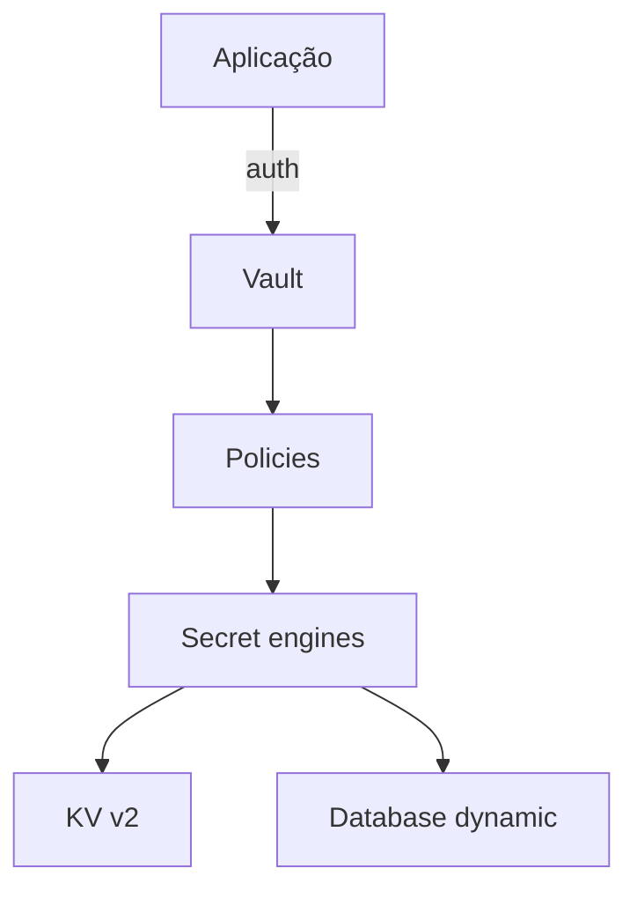
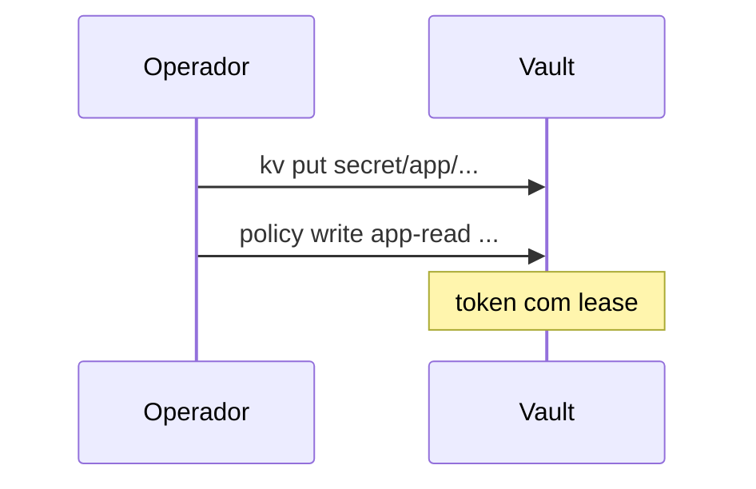
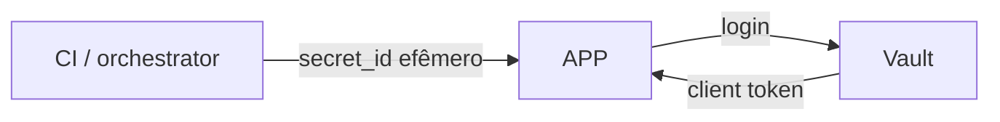

# HashiCorp Vault — segredos, políticas e integração

## Introdução

**Vault** centraliza **segredos** (KV estático), **certificados dinâmicos**, **credenciais de banco sob demanda** e **encryption as a service**. O modelo mental é: **políticas** (HCL) definem *quem* lê *o quê*; aplicações autenticam via **AppRole**, **Kubernetes auth**, **AWS IAM**, etc., e recebem **token** de curta duração.



---

## Laboratório: Vault em modo *dev* (não produção)

```bash
docker run --cap-add=IPC_LOCK -e 'VAULT_DEV_ROOT_TOKEN_ID=root' -p 8200:8200 hashicorp/vault:latest
export VAULT_ADDR='http://127.0.0.1:8200'
export VAULT_TOKEN=root
vault status
```

> **Modo dev** mantém dados em memória e imprime token root — use só para estudo.

### Habilitar KV v2 e gravar um segredo

```bash
vault secrets enable -path=secret kv-v2
vault kv put secret/app/config database_url="postgres://localhost/app" api_key="demo-not-real"
vault kv get secret/app/config
```



---

## Política mínima (leitura só desse path)

Arquivo `policy-app.hcl`:

```hcl
path "secret/data/app/*" {
  capabilities = ["read", "list"]
}
```

```bash
vault policy write app-read policy-app.hcl
```

---

## AppRole (conceito)

1. Crie **role** com `token_policies` e `bind_secret_id`.
2. Gere `role_id` e `secret_id` (CI ou orchestrator entrega à app).
3. A app faz `POST /v1/auth/approle/login` e usa o **client token**.



---

## Ler segredos via HTTP API (token no header)

### curl

```bash
curl -s \
  -H "X-Vault-Token: $VAULT_TOKEN" \
  "$VAULT_ADDR/v1/secret/data/app/config" | jq .
```

### Python (`urllib`)

```python
import json
import os
import urllib.request

def read_kv2(path: str) -> dict:
    addr = os.environ["VAULT_ADDR"].rstrip("/")
    token = os.environ["VAULT_TOKEN"]
    url = f"{addr}/v1/secret/data/{path}"
    req = urllib.request.Request(url, headers={"X-Vault-Token": token})
    with urllib.request.urlopen(req) as r:
        body = json.load(r)
    return body["data"]["data"]

if __name__ == "__main__":
    print(read_kv2("app/config"))
```

### Node.js (fetch)

```javascript
async function readKv2(path) {
  const base = process.env.VAULT_ADDR.replace(/\/$/, "");
  const token = process.env.VAULT_TOKEN;
  const res = await fetch(`${base}/v1/secret/data/${path}`, {
    headers: { "X-Vault-Token": token },
  });
  if (!res.ok) throw new Error(await res.text());
  const body = await res.json();
  return body.data.data;
}

readKv2("app/config").then(console.log).catch(console.error);
```

### Go

```go
package main

import (
	"encoding/json"
	"fmt"
	"io"
	"net/http"
	"os"
)

type kvResp struct {
	Data struct {
		Data map[string]string `json:"data"`
	} `json:"data"`
}

func main() {
	base := os.Getenv("VAULT_ADDR")
	token := os.Getenv("VAULT_TOKEN")
	req, _ := http.NewRequest(http.MethodGet, base+"/v1/secret/data/app/config", nil)
	req.Header.Set("X-Vault-Token", token)
	res, err := http.DefaultClient.Do(req)
	if err != nil {
		panic(err)
	}
	defer res.Body.Close()
	b, _ := io.ReadAll(res.Body)
	var out kvResp
	json.Unmarshal(b, &out)
	fmt.Println(out.Data.Data)
}
```

### Java (HttpClient)

```java
var client = HttpClient.newHttpClient();
var req = HttpRequest.newBuilder(URI.create(System.getenv("VAULT_ADDR") + "/v1/secret/data/app/config"))
    .header("X-Vault-Token", System.getenv("VAULT_TOKEN"))
    .GET()
    .build();
var res = client.send(req, HttpResponse.BodyHandlers.ofString());
System.out.println(res.body());
```

### C#

```csharp
using var client = new HttpClient { BaseAddress = new Uri(Environment.GetEnvironmentVariable("VAULT_ADDR")!) };
client.DefaultRequestHeaders.Add("X-Vault-Token", Environment.GetEnvironmentVariable("VAULT_TOKEN")!);
var json = await client.GetStringAsync("v1/secret/data/app/config");
Console.WriteLine(json);
```

### Spring Boot — dependência `spring-cloud-starter-vault-config` (conceito)

Em projetos Spring, o **Vault Config** injeta propriedades a partir de paths configurados em `bootstrap.yml` / `application.yml` — alinhe **namespace** e **authentication** (Kubernetes) com a doc atual do Spring Cloud.

---

## Boas práticas

- **Nunca** logar token ou payload de secret.
- **Lease** curto + renovação para credenciais dinâmicas.
- **Namespaces** (Enterprise) ou **paths** por time para isolamento lógico.
- **Unseal** e **Raft** em produção — siga o [Vault production hardening](https://developer.hashicorp.com/vault/docs/concepts/production-hardening).

---

## Referências

- [Vault documentation](https://developer.hashicorp.com/vault/docs)
- [KV secrets engine v2](https://developer.hashicorp.com/vault/docs/secrets/kv/kv-v2)

---

*Vault brilha quando **política** e **auth** são tão importantes quanto o **armazenamento** do segredo.*
