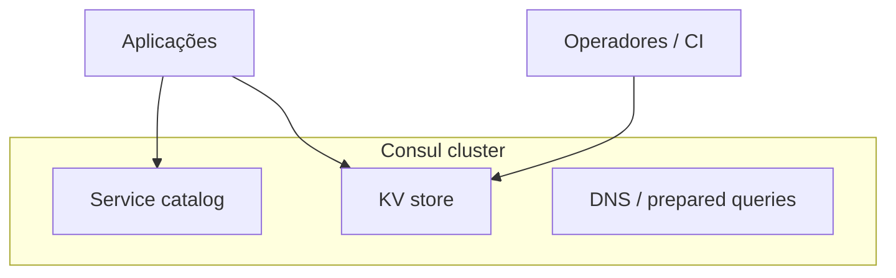
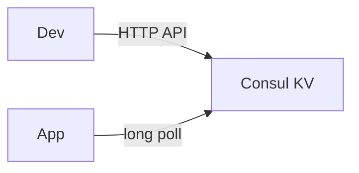
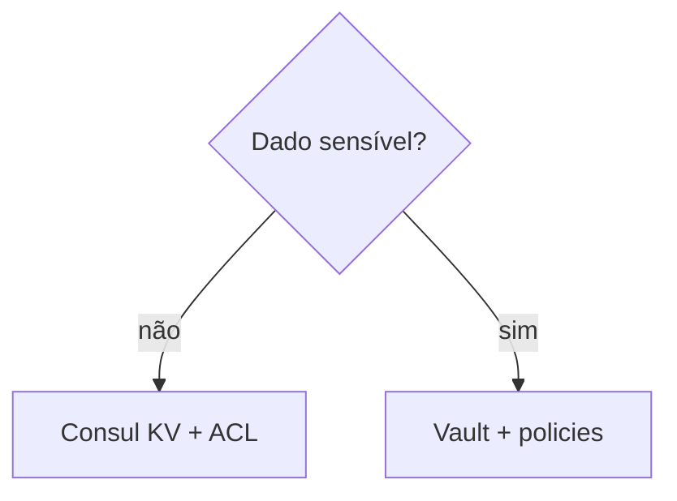

# HashiCorp Consul — descoberta de serviços e KV para configuração

## Introdução

**Consul** oferece **catálogo de serviços**, **health checks**, **KV store** (pares chave/valor versionados) e malha de serviços (**service mesh** com *Connect*). Para **configuração**, o uso mais comum é **Consul KV**: aplicações *watch* chaves ou fazem *blocking queries* para reagir a mudanças sem redeploy.



---

## Laboratório: agente Consul em modo *dev*

```bash
docker run -d --name=consul-dev -p 8500:8500 hashicorp/consul:latest agent -dev -client=0.0.0.0
export CONSUL_HTTP_ADDR=http://127.0.0.1:8500
consul kv put config/app/log_level info
consul kv get config/app/log_level
```



---

## Padrão: prefixo por ambiente

| Chave exemplo | Conteúdo |
|---------------|-----------|
| `config/prod/app/replicas` | `3` |
| `config/stg/app/replicas` | `1` |
| `config/prod/feature/payments_v2` | `true` |

Use **ACL tokens** em produção (`CONSUL_HTTP_TOKEN`) com políticas restritas.

---

## Ler e escrever KV via API

### curl

```bash
curl -s "$CONSUL_HTTP_ADDR/v1/kv/config/app/log_level" | jq .
```

### Python

```python
import base64
import json
import os
import urllib.request

def kv_get(key: str) -> str | None:
    addr = os.environ["CONSUL_HTTP_ADDR"].rstrip("/")
    token = os.environ.get("CONSUL_HTTP_TOKEN", "")
    req = urllib.request.Request(f"{addr}/v1/kv/{key}")
    if token:
        req.add_header("X-Consul-Token", token)
    try:
        with urllib.request.urlopen(req) as r:
            rows = json.load(r)
    except urllib.error.HTTPError as e:
        if e.code == 404:
            return None
        raise
    raw = base64.b64decode(rows[0]["Value"]).decode()
    return raw

print(kv_get("config/app/log_level"))
```

### Node.js

```javascript
import { Buffer } from "node:buffer";

async function kvGet(key) {
  const base = process.env.CONSUL_HTTP_ADDR.replace(/\/$/, "");
  const headers = {};
  if (process.env.CONSUL_HTTP_TOKEN)
    headers["X-Consul-Token"] = process.env.CONSUL_HTTP_TOKEN;
  const res = await fetch(`${base}/v1/kv/${encodeURIComponent(key)}`, { headers });
  if (res.status === 404) return null;
  if (!res.ok) throw new Error(await res.text());
  const rows = await res.json();
  return Buffer.from(rows[0].Value, "base64").toString("utf8");
}

kvGet("config/app/log_level").then(console.log);
```

### Go

```go
package main

import (
	"encoding/base64"
	"encoding/json"
	"fmt"
	"io"
	"net/http"
	"os"
)

type kvRow struct {
	Value string `json:"Value"`
}

func main() {
	addr := os.Getenv("CONSUL_HTTP_ADDR")
	res, err := http.Get(addr + "/v1/kv/config/app/log_level")
	if err != nil {
		panic(err)
	}
	defer res.Body.Close()
	b, _ := io.ReadAll(res.Body)
	var rows []kvRow
	json.Unmarshal(b, &rows)
	raw, _ := base64.StdEncoding.DecodeString(rows[0].Value)
	fmt.Println(string(raw))
}
```

### Java

```java
var client = HttpClient.newHttpClient();
var req = HttpRequest.newBuilder(URI.create(System.getenv("CONSUL_HTTP_ADDR") + "/v1/kv/config/app/log_level")).GET().build();
var res = client.send(req, HttpResponse.BodyHandlers.ofString());
System.out.println(res.body());
```

### C#

```csharp
using System.Net.Http.Json;
using System.Text;
using System.Text.Json;

var baseAddr = Environment.GetEnvironmentVariable("CONSUL_HTTP_ADDR")!;
using var client = new HttpClient { BaseAddress = new Uri(baseAddr) };
var rows = await client.GetFromJsonAsync<JsonElement[]>("v1/kv/config/app/log_level");
var b64 = rows![0].GetProperty("Value").GetString()!;
var value = Encoding.UTF8.GetString(Convert.FromBase64String(b64));
Console.WriteLine(value);
```

---

## *Blocking queries* (atualização sem polling agressivo)

O parâmetro `?index=<ModifyIndex>` com `wait=30s` permite que o servidor segure a conexão até haver mudança — padrão para **reload** de config em runtime.

---

## Consul vs Vault (quando usar o quê)

| Caso | Consul KV | Vault |
|------|-------------|-------|
| Feature flag, URL não sensível | Adequado | Possível, excessivo |
| Senha de banco, API key | Evite | Adequado |
| Certificado dinâmico | Connect + PKI | PKI / database secrets |



---

## Referências

- [Consul documentation](https://developer.hashicorp.com/consul/docs)
- [Consul KV HTTP API](https://developer.hashicorp.com/consul/api-docs/kv)

---

*Consul KV é **config distribuída** com *watch*; não substitui **Vault** para segredos de alto risco sem camadas extras.*
