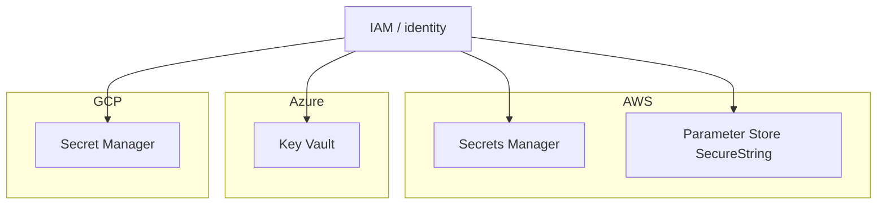
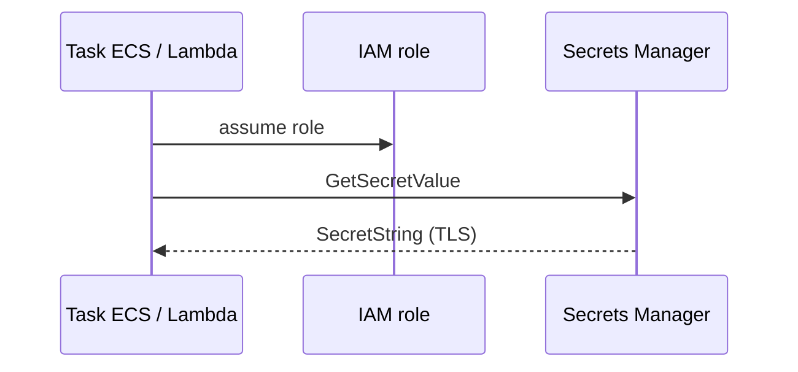

# Secret Managers na nuvem — AWS, Azure e GCP

## Introdução

Cada nuvem oferece **serviços gerenciados** para armazenar segredos com **cifragem em repouso**, **IAM** fino e **auditoria**. O padrão de aplicação é: **identidade do workload** (role do EC2, *managed identity*, *service account*) obtém o segredo em **runtime** — sem variável com valor no Dockerfile.



---

## AWS — Secrets Manager e Systems Manager Parameter Store

| Serviço | Uso típico |
|---------|------------|
| **Secrets Manager** | Rotação automática (RDS), string JSON, custo por segredo |
| **Parameter Store** | Hierarquia `/app/prod/db_url`, *SecureString* com KMS |

### Leitura via AWS CLI (debug)

```bash
aws secretsmanager get-secret-value --secret-id myapp/database --query SecretString --output text
aws ssm get-parameter --name /myapp/prod/api_key --with-decryption --query Parameter.Value --output text
```

### Python (boto3)

```python
import boto3

def get_secret_string(secret_id: str) -> str:
    c = boto3.client("secretsmanager", region_name="us-east-1")
    r = c.get_secret_value(SecretId=secret_id)
    return r["SecretString"]

print(get_secret_string("myapp/database"))
```

### Node.js (@aws-sdk/client-secrets-manager)

```javascript
import { SecretsManagerClient, GetSecretValueCommand } from "@aws-sdk/client-secrets-manager";

const client = new SecretsManagerClient({ region: "us-east-1" });
const out = await client.send(new GetSecretValueCommand({ SecretId: "myapp/database" }));
console.log(out.SecretString);
```

### Go

```go
package main

import (
	"context"
	"fmt"

	"github.com/aws/aws-sdk-go-v2/aws"
	"github.com/aws/aws-sdk-go-v2/config"
	"github.com/aws/aws-sdk-go-v2/service/secretsmanager"
)

func main() {
	cfg, _ := config.LoadDefaultConfig(context.TODO())
	c := secretsmanager.NewFromConfig(cfg)
	out, err := c.GetSecretValue(context.TODO(), &secretsmanager.GetSecretValueInput{
		SecretId: aws.String("myapp/database"),
	})
	if err != nil {
		panic(err)
	}
	fmt.Println(*out.SecretString)
}
```

### Java

```java
import software.amazon.awssdk.regions.Region;
import software.amazon.awssdk.services.secretsmanager.SecretsManagerClient;
import software.amazon.awssdk.services.secretsmanager.model.GetSecretValueRequest;

try (var client = SecretsManagerClient.builder().region(Region.US_EAST_1).build()) {
  var resp = client.getSecretValue(
      GetSecretValueRequest.builder().secretId("myapp/database").build());
  System.out.println(resp.secretString());
}
```

### C#

```csharp
using Amazon;
using Amazon.SecretsManager;
using Amazon.SecretsManager.Model;

var client = new AmazonSecretsManagerClient(RegionEndpoint.USEast1);
var resp = await client.GetSecretValueAsync(new GetSecretValueRequest { SecretId = "myapp/database" });
Console.WriteLine(resp.SecretString);
```



---

## Azure — Key Vault

**Key Vault** guarda *secrets*, chaves e certificados. Aplicações usam **Managed Identity** ou **service principal** com RBAC (`Key Vault Secrets User`).

### Azure CLI

```bash
az keyvault secret show --vault-name myvault --name DatabaseUrl --query value -o tsv
```

### Python (`azure-identity` + `azure-keyvault-secrets`)

```python
from azure.identity import DefaultAzureCredential
from azure.keyvault.secrets import SecretClient

vault_url = "https://myvault.vault.azure.net/"
client = SecretClient(vault_url=vault_url, credential=DefaultAzureCredential())
print(client.get_secret("DatabaseUrl").value)
```

### C# (SDK)

```csharp
using Azure.Identity;
using Azure.Security.KeyVault.Secrets;

var client = new SecretClient(new Uri("https://myvault.vault.azure.net/"), new DefaultAzureCredential());
var secret = await client.GetSecretAsync("DatabaseUrl");
Console.WriteLine(secret.Value.Value);
```

---

## GCP — Secret Manager

### gcloud

```bash
gcloud secrets versions access latest --secret=myapp-api-key
```

### Python

```python
from google.cloud import secretmanager

def access(project_id: str, secret_id: str) -> str:
    client = secretmanager.SecretManagerServiceClient()
    name = f"projects/{project_id}/secrets/{secret_id}/versions/latest"
    return client.access_secret_version(request={"name": name}).payload.data.decode("UTF-8")
```

### Node.js

```javascript
import { SecretManagerServiceClient } from "@google-cloud/secret-manager";
const client = new SecretManagerServiceClient();
const [version] = await client.accessSecretVersion({
  name: "projects/my-project/secrets/myapp-api-key/versions/latest",
});
console.log(version.payload.data.toString());
```

---

## Boas práticas multi-nuvem

- **Um segredo por conceito** (evitar JSON gigante compartilhado por 20 apps).
- **Cache com TTL** curto na aplicação para não martelar a API (com invalidação em *SIGTERM*).
- **Nunca** imprimir valor em log — mascare em diagnósticos.

---

## Referências

- [AWS Secrets Manager](https://docs.aws.amazon.com/secretsmanager/)
- [AWS Systems Manager Parameter Store](https://docs.aws.amazon.com/systems-manager/latest/userguide/systems-manager-parameter-store.html)
- [Azure Key Vault](https://learn.microsoft.com/azure/key-vault/)
- [GCP Secret Manager](https://cloud.google.com/secret-manager/docs)

---

*O segredo mora na **nuvem**; o que a app carrega é **valor em memória** com **identidade** explícita.*
