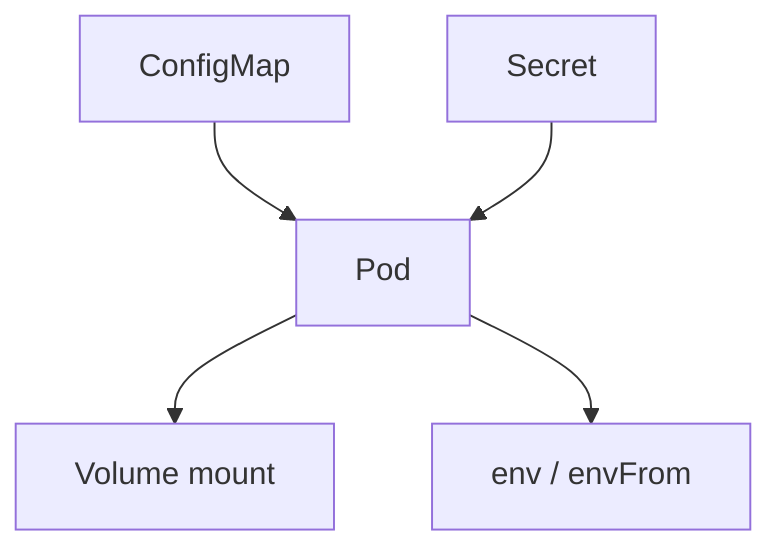
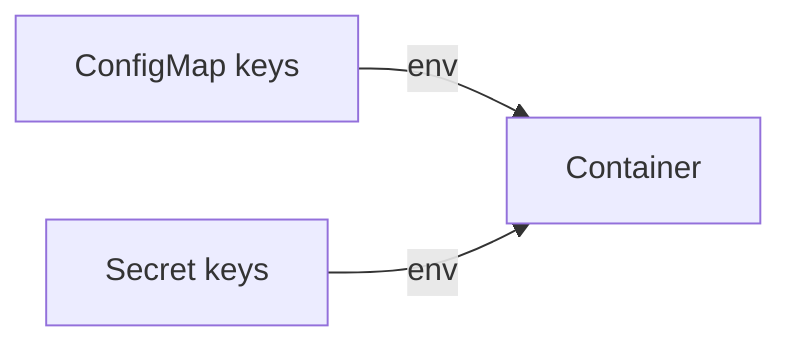

# Kubernetes — ConfigMap e Secret

## Introdução

No **Kubernetes**, **ConfigMap** armazena dados de configuração **não sensíveis** (chaves, URLs, `application.properties`). **Secret** armazena dados sensíveis — ainda assim, por padrão, **apenas base64** (não cifragem forte no etcd sem *encryption at rest* configurada). Trate **Secret** como confidencial em trânsito (RBAC, *etcd* encriptado, *external secrets*).



---

## ConfigMap imperativo (laboratório)

```bash
kubectl create configmap app-config --from-literal=log_level=info --from-literal=max_workers=4
kubectl get configmap app-config -o yaml
```

### A partir de ficheiro

```bash
kubectl create configmap app-files --from-file=./config/app.properties
```

---

## Secret imperativo (exemplo — não commitar valores reais)

```bash
kubectl create secret generic app-db --from-literal=url='postgres://user:pass@db:5432/app'
```

Para **docker-registry** ou **TLS**, use `kubectl create secret docker-registry` / `tls`.

---

## Consumir como variáveis de ambiente

```yaml
apiVersion: v1
kind: Pod
metadata:
  name: demo
spec:
  containers:
    - name: app
      image: nginx:alpine
      env:
        - name: LOG_LEVEL
          valueFrom:
            configMapKeyRef:
              name: app-config
              key: log_level
        - name: DATABASE_URL
          valueFrom:
            secretKeyRef:
              name: app-db
              key: url
```

### `envFrom` (prefixo opcional)

```yaml
      envFrom:
        - configMapRef:
            name: app-config
        - secretRef:
            name: app-db
```



---

## Montar como ficheiros (preferível para apps que leem ficheiro)

```yaml
      volumeMounts:
        - name: cfg
          mountPath: /config
          readOnly: true
        - name: creds
          mountPath: /var/secrets
          readOnly: true
  volumes:
    - name: cfg
      configMap:
        name: app-config
    - name: creds
      secret:
        secretName: app-db
```

Kubernetes cria ficheiros com o **nome da chave** (ex.: `url`).

---

## Deployment mínimo (referência)

```yaml
apiVersion: apps/v1
kind: Deployment
metadata:
  name: api
spec:
  replicas: 1
  selector:
    matchLabels: { app: api }
  template:
    metadata:
      labels: { app: api }
    spec:
      containers:
        - name: api
          image: myregistry/api:1.0.0
          envFrom:
            - configMapRef: { name: app-config }
          env:
            - name: DATABASE_URL
              valueFrom:
                secretKeyRef: { name: app-db, key: url }
```

---

## Boas práticas

- **RBAC**: só a *ServiceAccount* do workload lê o Secret.
- **Não** versionar `Secret` YAML com valores em Git — use **Sealed Secrets**, **External Secrets Operator** ou **CSI Secret Store**.
- **Immutability** (`immutable: true`) em Secret quando aplicável para reduzir *watch* storms.

---

## Integração com leitura em código

### Node.js — `process.env` (após injeção K8s)

```javascript
const dbUrl = process.env.DATABASE_URL;
if (!dbUrl) throw new Error("DATABASE_URL ausente");
```

### Python

```python
import os

DATABASE_URL = os.environ["DATABASE_URL"]
```

### Spring Boot — `SPRING_DATASOURCE_URL` ou `application.properties` montado

Monte ConfigMap em `/config` e use `spring.config.additional-location=file:/config/`.

### C# — *options pattern*

```csharp
var dbUrl = builder.Configuration["DATABASE_URL"]
    ?? throw new InvalidOperationException("DATABASE_URL ausente");
```

---

## Referências

- [ConfigMaps](https://kubernetes.io/docs/concepts/configuration/configmap/)
- [Secrets](https://kubernetes.io/docs/concepts/configuration/secret/)
- [External Secrets Operator](https://external-secrets.io/)

---

*ConfigMap para **dados operacionais**; Secret para **credenciais** — e ainda assim planeje **fonte externa** para rotação central.*
