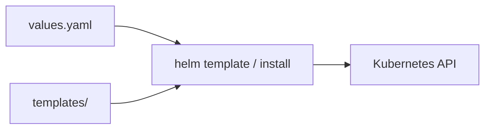
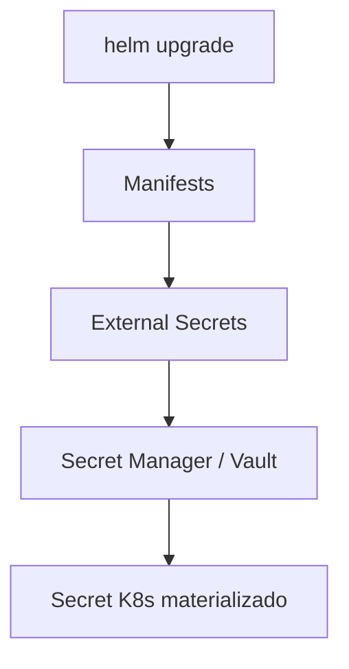

# Helm Charts — values, templates e segredos

## Introdução

**Helm** é o gestor de pacotes de facto para Kubernetes: um **Chart** é um diretório com `Chart.yaml`, `values.yaml` e templates **Go templates** em `templates/*.yaml`. O comando `helm install` renderiza templates com **values** e envia manifests ao API server.



---

## Instalação do CLI

```bash
# Linux — exemplo com script oficial (ver doc atual)
curl https://raw.githubusercontent.com/helm/helm/main/scripts/get-helm-3 | bash
helm version
```

---

## Estrutura mínima de um chart

```text
meu-chart/
├── Chart.yaml
├── values.yaml
└── templates/
    ├── deployment.yaml
    ├── service.yaml
    └── _helpers.tpl
```

### `Chart.yaml`

```yaml
apiVersion: v2
name: meu-chart
description: API de exemplo
type: application
version: 0.1.0
appVersion: "1.0.0"
```

### `values.yaml` (defaults — sem segredos reais)

```yaml
replicaCount: 2
image:
  repository: myregistry/api
  tag: "1.0.0"
  pullPolicy: IfNotPresent
service:
  port: 80
  targetPort: 8080
config:
  logLevel: info
# secrets devem vir de --set-file, External Secrets ou CI, não commitados
```

---

## Template de Deployment com `tpl` e `toYaml`

`templates/deployment.yaml`:

```yaml
apiVersion: apps/v1
kind: Deployment
metadata:
  name: {{ include "meu-chart.fullname" . }}
spec:
  replicas: {{ .Values.replicaCount }}
  selector:
    matchLabels:
      app: {{ include "meu-chart.name" . }}
  template:
    metadata:
      labels:
        app: {{ include "meu-chart.name" . }}
    spec:
      containers:
        - name: api
          image: "{{ .Values.image.repository }}:{{ .Values.image.tag }}"
          imagePullPolicy: {{ .Values.image.pullPolicy }}
          ports:
            - containerPort: {{ .Values.service.targetPort }}
          env:
            - name: LOG_LEVEL
              value: {{ .Values.config.logLevel | quote }}
```

### `_helpers.tpl` (fragmento)

```yaml
{{- define "meu-chart.name" -}}
{{- default .Chart.Name .Values.nameOverride | trunc 63 | trimSuffix "-" -}}
{{- end }}
```

---

## Passar segredos sem gravar em `values.yaml`

### Opção A — `helm install` com `--set`

```bash
helm upgrade --install api ./meu-chart \
  --set secret.databaseUrl="postgres://..." \
  --namespace prod
```

> Ainda aparece em *shell history* — prefira ficheiro temporário ou store externo.

### Opção B — ficheiro de values sensível (não versionado)

```bash
helm upgrade --install api ./meu-chart -f values-prod.yaml -f secrets-local.yaml
```

### Opção C — **External Secrets** / **Vault Agent Injector**

O chart só referencia **nome** do Secret; o conteúdo é preenchido fora do Helm.



---

## Comandos úteis

| Comando | Função |
|---------|--------|
| `helm template .` | Renderiza YAML sem aplicar (review em PR) |
| `helm lint .` | Valida chart |
| `helm diff upgrade` | Requer plugin — diff antes do apply |
| `helm uninstall api` | Remove release |

---

## Teste local com `helm template` e `kubeconform` (opcional)

```bash
helm template api ./meu-chart -f ci-values.yaml > /tmp/rendered.yaml
# opcional: kubeconform -summary -strict /tmp/rendered.yaml
```

---

## Hooks e jobs (conceito)

`helm test` executa pods de teste declarados no chart; **hooks** (`pre-install`, `post-upgrade`) rodam Jobs — use com parcimônia para migrações.

---

## Boas práticas

- **values.schema.json** para validar tipos em CI.
- **Separe** `values-dev.yaml` / `values-prod.yaml` por ambiente; não duplique centenas de linhas — use *global* e subcharts.
- **Versionamento** do chart (`version`) independente da app (`appVersion`).

---

## Referências

- [Helm documentation](https://helm.sh/docs/)
- [Chart best practices](https://helm.sh/docs/chart_best_practices/)

---

*Helm orquestra **como** os manifests são gerados; a **fonte da verdade** dos segredos ainda deve ser **Vault / Secret Manager / ESO**, não o repositório Git.*
