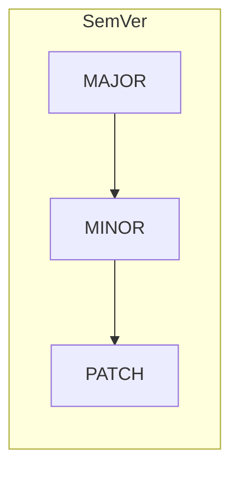
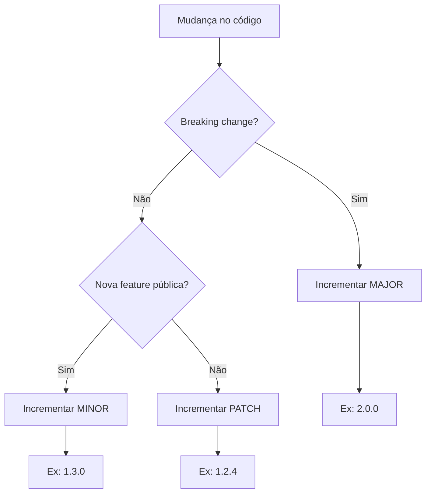

# Versionamento de aplicações

## Por que versionar?

Versionar aplicações e bibliotecas permite que consumidores (outros times, clientes, CI/CD) saibam **o que mudou** entre releases, **compatibilidade** (breaking vs backward-compatible) e **quando** uma versão foi publicada. Facilita rollback, auditoria e integração com ferramentas.

## Semantic Versioning (SemVer)

O [SemVer](https://semver.org/) usa três números: **MAJOR.MINOR.PATCH** (ex.: `2.1.3`).

| Componente | Quando incrementar | Exemplo |
|------------|--------------------|---------|
| **MAJOR** | Mudanças incompatíveis com versões anteriores (breaking changes) | `1.0.0` → `2.0.0` |
| **MINOR** | Nova funcionalidade compatível com versões anteriores | `1.2.0` → `1.3.0` |
| **PATCH** | Correções de bugs compatíveis | `1.2.3` → `1.2.4` |

Pré-releases podem usar sufixos: `1.0.0-alpha.1`, `2.1.0-beta`, `1.0.0-rc.1`.

## Fluxo típico de decisão

## Onde a versão vive

- **Arquivos de projeto:** `package.json` (Node), `pom.xml` / `build.gradle` (Java), `*.csproj` (C#), `project.clj` (Clojure), etc.
- **Tags Git:** muitas equipes criam uma tag por release (ex.: `v1.2.3`) para rastreabilidade.
- **CI/CD:** o pipeline lê a versão do projeto ou do tag e usa para artefatos, imagens Docker e release notes.

## Boas práticas

- **Changelog** – Manter um arquivo (CHANGELOG.md) ou release notes com as mudanças por versão.
- **Consistência** – Usar o mesmo esquema em todos os serviços da organização.
- **Automação** – Bump de versão e criação de tag via pipeline ou ferramentas (e.g. standard-version, semantic-release) reduz erros.

---

*Próximo: [Git e GitHub](./02-git-github.md).*
