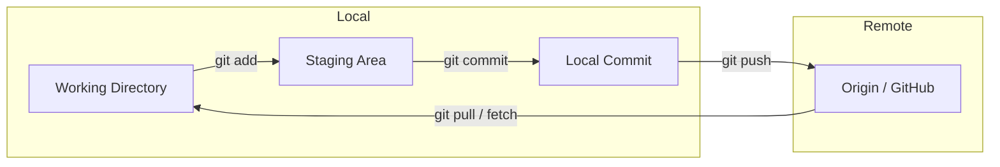

# Git e GitHub

## O que é Git?

Git é um **sistema de controle de versão distribuído**: cada desenvolvedor tem uma cópia completa do histórico do repositório. Permite trabalhar offline, criar branches locais, fazer commits e depois sincronizar com um remoto (ex.: GitHub, GitLab, Bitbucket).

## Conceitos principais



| Conceito | Descrição |
|----------|-----------|
| **Working directory** | Arquivos no disco; alterações ainda não preparadas |
| **Staging (index)** | Área de preparação; o que será incluído no próximo commit |
| **Commit** | Snapshot do projeto em um ponto do tempo, com hash único |
| **Branch** | Ponteiro móvel para um commit; permite linhas de desenvolvimento paralelas |
| **Remote** | Repositório em um servidor (ex.: GitHub); `origin` é o nome padrão |

## Fluxo local → remoto

```mermaid
sequenceDiagram
  participant Dev as Developer
  participant Local as Local Repo
  participant Remote as GitHub

  Dev->>Local: git add / git commit
  Local->>Local: branch updated
  Dev->>Local: git push origin &lt;branch&gt;
  Local->>Remote: upload commits
  Remote->>Remote: update refs (branch, PR)
```

## GitHub: colaboração

- **Clone** – Copiar um repositório remoto para a máquina (`git clone <url>`).
- **Fork** – Cópia do repositório na sua conta; usado para contribuir em projetos onde você não tem write access.
- **Pull request (PR)** – Proposta de mudança: sua branch é comparada à branch base (ex.: `main`); revisores aprovam e fazem merge.
- **Autenticação** – HTTPS exige token (senha não é mais aceita); SSH usa chaves. Ver [Melhores práticas – PR](./04-melhores-praticas-pull-requests.md) e documentação do GitHub.

## Comandos essenciais

| Ação | Comando |
|------|---------|
| Ver status | `git status` |
| Adicionar ao stage | `git add <file>` ou `git add .` |
| Commitar | `git commit -m "message"` |
| Criar/mudar branch | `git checkout -b <branch>` ou `git switch -c <branch>` |
| Enviar para remoto | `git push -u origin <branch>` |
| Atualizar do remoto | `git pull origin <branch>` ou `git fetch` + `git merge` / `git rebase` |

---

*Próximo: [Git Flow e commit semântico](./03-git-flow-commit-semantico.md).*
