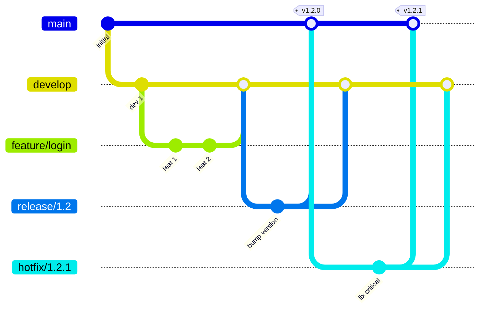
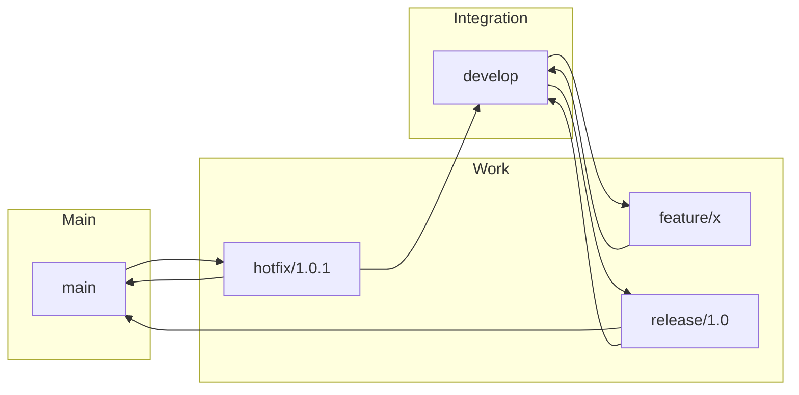
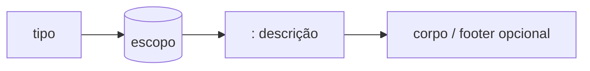

# Git Flow e commit semântico

## Git Flow em resumo

Git Flow é um **modelo de branches** que define ramos principais e de apoio, com papéis claros para desenvolvimento, release e hotfix.

## Branches principais

| Branch | Uso |
|--------|-----|
| **main** (ou master) | Código em produção; cada commit costuma ser uma release (tag). |
| **develop** | Integração das features; base para novas funcionalidades. |

## Branches de apoio

| Branch | Uso |
|--------|-----|
| **feature/\*** | Nova funcionalidade; criada a partir de `develop`; merge de volta em `develop`. |
| **release/\*** | Preparação de release (bump de versão, ajustes finais); merge em `main` e em `develop`. |
| **hotfix/\*** | Correção urgente em produção; criada a partir de `main`; merge em `main` e em `develop`. |

## Fluxo simplificado

Muitas equipes usam variações (ex.: só `main` + feature branches, ou trunk-based) conforme o processo de deploy.

## Commit semântico (Conventional Commits)

Padrão de **mensagem de commit** que facilita leitura do histórico e geração de changelogs.

Formato: **tipo(escopo opcional): descrição**

### Tipos mais usados

| Tipo | Uso |
|------|-----|
| **feat** | Nova funcionalidade |
| **fix** | Correção de bug |
| **docs** | Apenas documentação |
| **style** | Formatação (sem mudança de lógica) |
| **refactor** | Refatoração (sem nova feature nem fix) |
| **test** | Testes |
| **chore** | Tarefas de build, CI, deps |

### Exemplos

- `feat(auth): add OAuth2 login`
- `fix(api): correct status code on validation error`
- `docs(readme): update installation steps`
- `chore(deps): bump lodash to 4.17.21`

### Breaking changes

No footer: `BREAKING CHANGE: description` ou no tipo: `feat!: remove deprecated API`. Ferramentas como semantic-release usam isso para incrementar MAJOR.

---

*Próximo: [Melhores práticas para Pull Requests](./04-melhores-praticas-pull-requests.md).*
