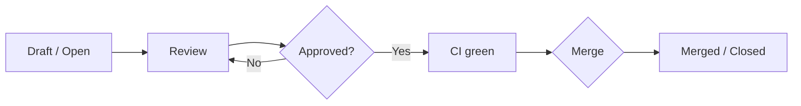
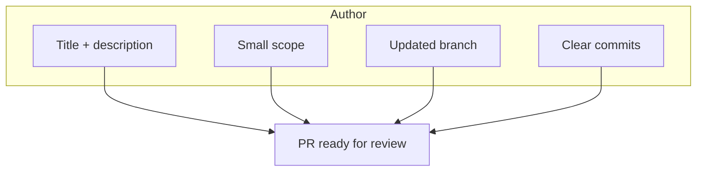

# Melhores práticas para criação e validação de Pull Requests

## Objetivo do PR

Um Pull Request é uma **proposta de mudança** revisável: permite discussão, checagens automatizadas (CI) e integração controlada na branch base. Boas práticas na criação e na revisão melhoram qualidade e ritmo do time.

## Ciclo de vida de um PR

## Criação: boas práticas

### Título e descrição

- **Título** – Objetivo em uma linha; idealmente no padrão do commit semântico (ex.: `feat(api): add pagination to list endpoint`).
- **Descrição** – O que mudou, por que e como validar (passos para testar, cenários). Template padronizado ajuda.

### Escopo e tamanho

- **Um PR = uma mudança lógica** – Feature, fix ou refactor coeso; evite “várias coisas” no mesmo PR.
- **Tamanho** – PRs menores são mais fáceis de revisar e de reverter; quebrar em vários PRs quando fizer sentido.

### Commits e branch

- **Branch** – Criada a partir da branch base atualizada (ex.: `main` ou `develop`); nome descritivo: `feat/nome-da-feature`, `fix/issue-123`.
- **Commits** – Mensagens claras e, se possível, semânticas; histórico limpo (squash ou rebase conforme política do time).

## Validação (review): boas práticas

### Para o revisor

- **Entender o contexto** – Ler descrição e linked issues; rodar ou testar quando possível.
- **Foco** – Correto (lógica, edge cases), seguro (dados, permissões), alinhado ao padrão do projeto e manutenível.
- **Comentários** – Objetivos e construtivos; sugestões de código quando útil; perguntas em vez de ordens quando for dúvida.
- **Tempo** – Revisar em prazo combinado para não bloquear o fluxo.

### Para o autor

- **Responder** – Esclarecer dúvidas e indicar o que foi alterado após sugestões.
- **Não levar para o pessoal** – Review é sobre o código e o produto; incorporar feedback ou discutir com argumentos técnicos.

### Checklist típico no PR

- [ ] Descrição preenchida e compreensível
- [ ] Build e testes passando (CI)
- [ ] Sem conflitos com a branch base
- [ ] Revisão aprovada (conforme política)
- [ ] Atualizações de documentação quando necessário

## Merge e pós-merge

- **Estratégia** – Merge commit, squash ou rebase: definir no repositório e manter consistência.
- **Pós-merge** – Deletar branch do remoto (opcional, muitas vezes automático); comunicar se a mudança exigir deploy ou ação de outros.

---

*Voltar ao [índice](./README.md).*
